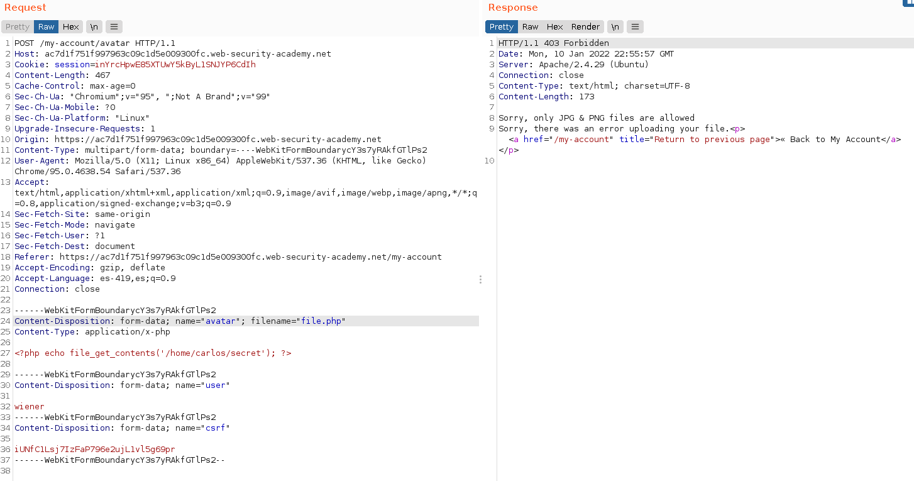
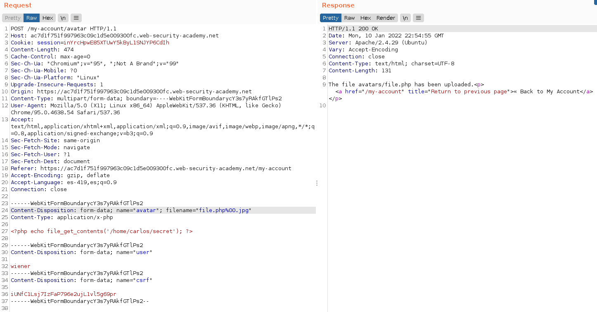
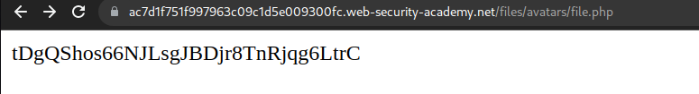

+++
author = "Alux"
title = "Portswigger Academy Learning Path: File Upload Lab 6"
date = "2022-01-03"
description = "Lab: Web shell upload via obfuscated file extension"
tags = [
    "file upload",
    "portswigger",
    "academy",
    "burpsuite",
]
categories = [
    "pentest web",
]
series = ["Portswigger Labs"]
image = "head.png"
+++

# Lab: Web shell upload via obfuscated file extension

En este <cite>laboratorio[^1]</cite>la finalidad es subir una shell al servidor para luego poder extraer o recuperar informacion de este. En este caso tenemos que leer el archivo `/home/carlos/secret`

## Reconocimiento

Cuando ingresamos con la cuenta de `wiener:peter` tenemos una opcion para subir archivos, en este caso el avatar del usuario, pero al intentar subir una imagen no nos da una opcion para poder elegir imagen u otro.


Todo bien pero el sistema parece que no ejecuta el codigo php desde la carpeta, haciendo que cualquier archivo php solo podamos ver el contenido del `php` como si fuera texto plano.

## Explotacion

Creamos el archivo php con el siguiente codigo

```php
<?php echo file_get_contents('/home/carlos/secret'); ?>
```

Ahora enviamos el archivo, y vemos la respuesta que nos da diciendo que no se permite subir archivos de tipo `php` solamente `jpg y png` 



### Metodos para realizar bypass

Existen varias maneras de hacer bypass a esto como una de las siguientes:

1. Cambiando el nombre del archivo y esperando que el sistema lo reconozca, algo como file.php.jpg
2. Agregar un punto o algun otro caracter para que el sistema lo elimine o lo ignore, pudiendo ser algo como file.php.
3. Usando url encoding como %2E que es el . en URL
4. Agregando caracteres al final para eliminar lo que va despues de nuestro nombre de archivo como file.php%00 o file.php;.jpg
5. O si el sistema elimina automaticamente el tipo de archivo realizar algo para que al eliminarlo siempre quede el nombre de archivo como deseamos, como file.p`.php`hp y al final quedaria file.php

Ahora que sabemos que solo acepta `jpg y png` y el sistema solo valida el final del nombre del archivo pero si colocamos `;` u otros valores tambien los agrega y los toma como nombre de archivo pero con `%00` que es un byte nulo no lo hace por lo que podemos subir el archivo  sin problema y con el nombre que lo toma



Y podemos ver la key sin problemas



Y con esto resolvimos el lab, pudiendo subir un archivo php que ejecuta acciones o comandos en el servidor.


[^1]: [Laboratorio](https://portswigger.net/web-security/file-upload/lab-file-upload-web-shell-upload-via-obfuscated-file-extension)