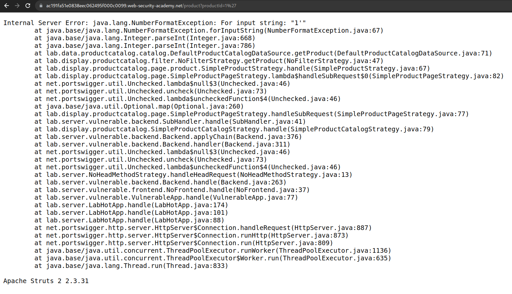
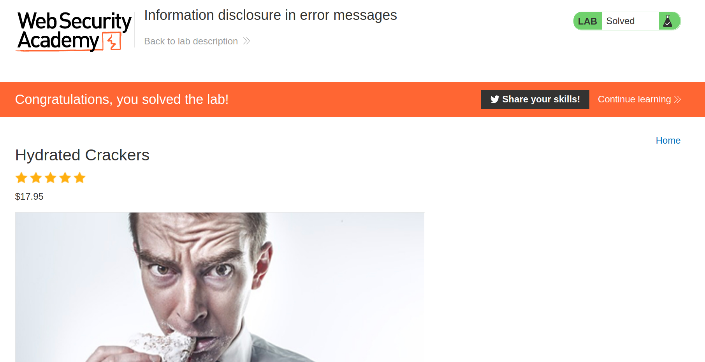

+++
author = "Alux"
title = "Portswigger Academy Learning Path: Information Disclosure Lab 1"
date = "2021-12-15"
description = "Lab: Information disclosure in error messages"
tags = [
    "information disclosure",
    "portswigger",
    "academy",
    "burpsuite",
]
categories = [
    "pentest web",
]
series = ["Portswigger Labs"]
image = "head.png"
+++

# Lab: Information disclosure in error messages

En este <cite>laboratorio[^1]</cite>la finalidad es poder mostrar en la aplicacion informacion de la infraestructura, software o algo que revele informacion del sistema. Esta vulnerabilidad mas conocida como `Information Disclosure`.

## Reconocimiento

Lo primero que tenemos es una aplicacion que muestra articulos y este es un ejemplo de ellos. El link es el siguiente:

```
https://ac191fa51e0838eec062495f000c0099.web-security-academy.net/product?productId=1
```


## Explotacion

Teniendo esto podemos pensar que lo primero es que generar un error al ingresar el id del articulo, que tambien funciona para saber si algo puede ser vulnerable a sqli. Esto lo haremos injectando una comilla simple `'` o `"` o `<>` se puede intentar con cualquiera.

```
https://ac191fa51e0838eec062495f000c0099.web-security-academy.net/product?productId=1'
```
Y genera el siguiente error que genera el nombre de la aplicacion:



Y ahora ingresamos la solucion y resolvimos el lab:



[^1]: [Laboratorio](https://portswigger.net/web-security/information-disclosure/exploiting/lab-infoleak-in-error-messages)