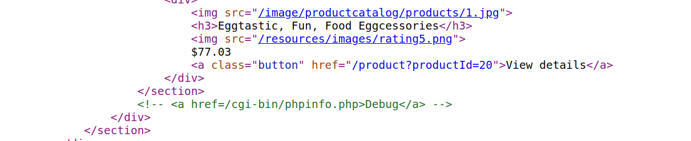
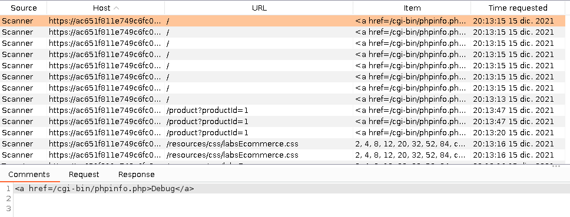
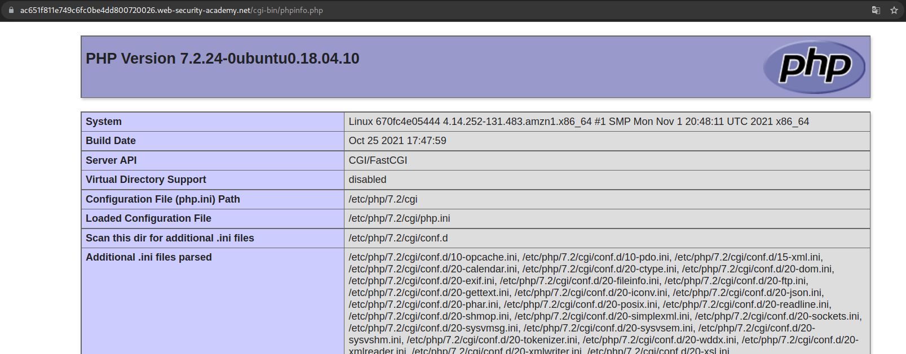
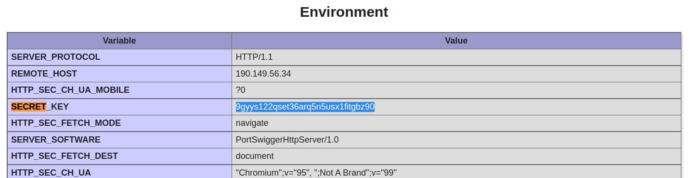
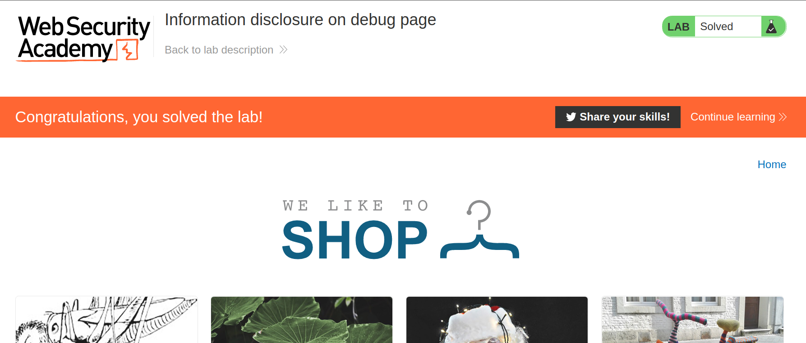

+++
author = "Alux"
title = "Portswigger Academy Learning Path: Information Disclosure Lab 2"
date = "2021-12-15"
description = "Lab: Information disclosure on debug page"
tags = [
    "information disclosure",
    "portswigger",
    "academy",
    "burpsuite",
]
categories = [
    "pentest web",
]
series = ["Portswigger Labs"]
image = "head.png"
+++

# Lab: Information disclosure on debug page

En este <cite>laboratorio[^1]</cite>la finalidad es poder mostrar en la aplicacion informacion de la infraestructura, software o algo que revele informacion del sistema. Esta vulnerabilidad mas conocida como `Information Disclosure`.

## Reconocimiento

Lo primero que tenemos es una aplicacion que muestra articulos y en el podemos ver detalles, lo que hay que obtener es la SECRET_KEY que esta en las variables de entorno, lo que nos hace recordar que la manera de ver esto es posible en HP desde un archivo en phpinfo.

## Explotacion

Lo que vamos a hacer es la manera de buscar el phpinfo, ingresamos directamente a `phpinfo.php` pero no existe, por lo que podemos buscar comentarios o en el codigo fuente.

### Buscar la URL

O a traves de las herramientas de burpsuite

1. Vamos a Target > Site map
2. Damos clic derecho en el sitio web
3. Engagement Tools > Find Comments

Y se lista a continuacion los codigos: Information

### Buscar la secret key

Ahora accedemos al archivo: 

Y buscando encontramos la key:

Y ahora ingresamos la solucion y resolvimos el lab:

[^1]: [Laboratorio](https://portswigger.net/web-security/information-disclosure/exploiting/lab-infoleak-on-debug-page)