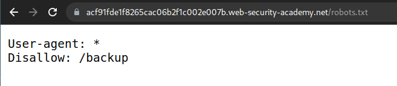
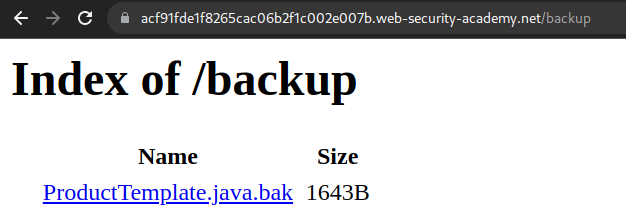
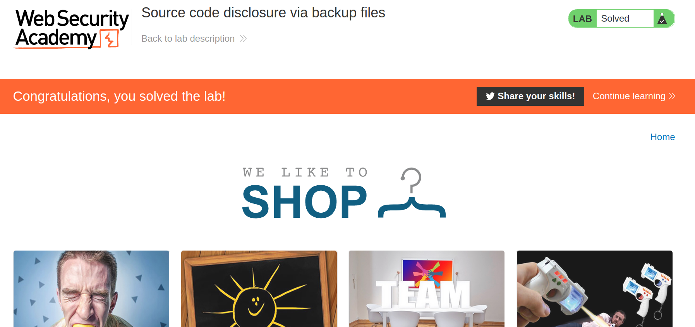

+++
author = "Alux"
title = "Portswigger Academy Learning Path: Information Disclosure Lab 3"
date = "2021-12-15"
description = "Lab: Source code disclosure via backup files"
tags = [
    "information disclosure",
    "portswigger",
    "academy",
    "burpsuite",
]
categories = [
    "pentest web",
]
series = ["Portswigger Labs"]
image = "head.png"
+++

# Lab: Source code disclosure via backup files

En este <cite>laboratorio[^1]</cite>la finalidad es poder mostrar en la aplicacion informacion de la infraestructura, software o algo que revele informacion del sistema. Esta vulnerabilidad mas conocida como `Information Disclosure`.

## Reconocimiento

Lo primero que tenemos es una aplicacion que muestra articulos pero lo que debemos hacer es una archivo de backups que nos pueda dar la contrasena que necesitamos.

## Explotacion

Buscamos entre el codigo fuente no encontramos nada y entre los comentarios, asi que buscamos otra manera, y en la ruta de `/robots.txt` podemos ver si encontramos algo.



Ahora listamos lo que encontramos en ese archivo robots



Y podemos ver que tiene un archivo de backup que podemos visualizar, lo abrimos y nos lista a continuacion el codigo y encontramos la contrasena de postgresql

```java
package data.productcatalog;

import common.db.ConnectionBuilder;

import java.io.IOException;
import java.io.ObjectInputStream;
import java.io.Serializable;
import java.sql.Connection;
import java.sql.ResultSet;
import java.sql.SQLException;
import java.sql.Statement;

public class ProductTemplate implements Serializable
{
    static final long serialVersionUID = 1L;

    private final String id;
    private transient Product product;

    public ProductTemplate(String id)
    {
        this.id = id;
    }

    private void readObject(ObjectInputStream inputStream) throws IOException, ClassNotFoundException
    {
        inputStream.defaultReadObject();

        ConnectionBuilder connectionBuilder = ConnectionBuilder.from(
                "org.postgresql.Driver",
                "postgresql",
                "localhost",
                5432,
                "postgres",
                "postgres",
                "zkzsf7azhrcee4r127holbxpwkaq8f3g"
        ).withAutoCommit();
        try
        {
            Connection connect = connectionBuilder.connect(30);
            String sql = String.format("SELECT * FROM products WHERE id = '%s' LIMIT 1", id);
            Statement statement = connect.createStatement();
            ResultSet resultSet = statement.executeQuery(sql);
            if (!resultSet.next())
            {
                return;
            }
            product = Product.from(resultSet);
        }
        catch (SQLException e)
        {
            throw new IOException(e);
        }
    }

    public String getId()
    {
        return id;
    }

    public Product getProduct()
    {
        return product;
    }
}
```

Y ahora ingresamos la solucion y resolvimos el lab:



[^1]: [Laboratorio](https://portswigger.net/web-security/information-disclosure/exploiting/lab-infoleak-via-backup-files)