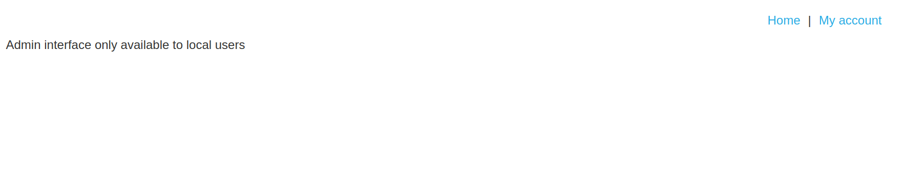
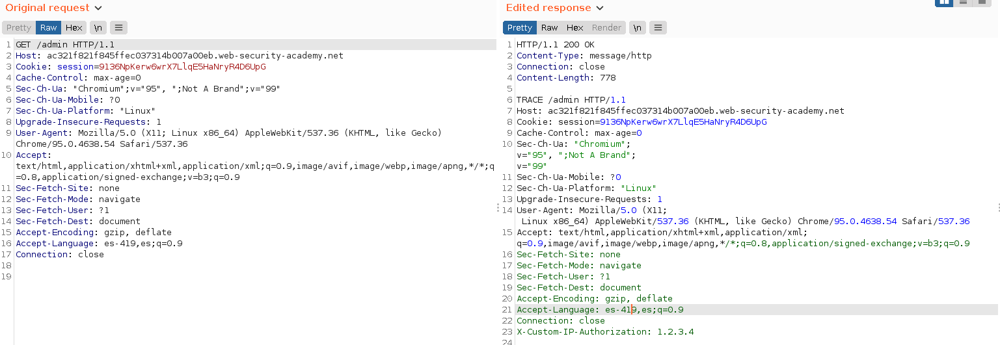
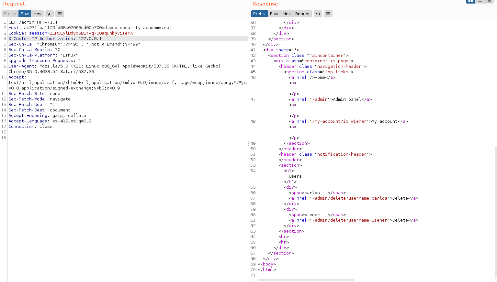
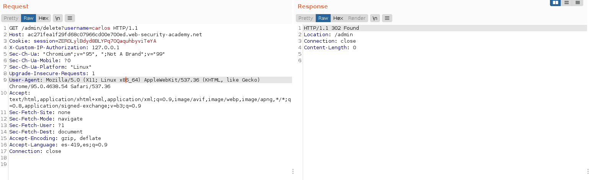
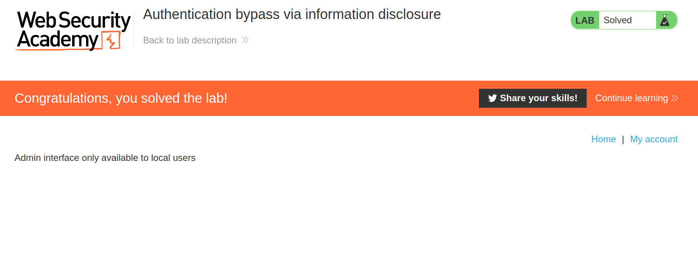

+++
author = "Alux"
title = "Portswigger Academy Learning Path: Information Disclosure Lab 4"
date = "2021-12-15"
description = "Lab: Authentication bypass via information disclosure"
tags = [
    "information disclosure",
    "portswigger",
    "academy",
    "burpsuite",
]
categories = [
    "pentest web",
]
series = ["Portswigger Labs"]
image = "head.png"
+++

# Lab: Authentication bypass via information disclosure

En este <cite>laboratorio[^1]</cite>la finalidad es poder mostrar en la aplicacion informacion de la infraestructura, software o algo que revele informacion del sistema. Esta vulnerabilidad mas conocida como `Information Disclosure`.

## Reconocimiento

Lo primero que tenemos es que la aplicacion nos da unas credenciales de `wiener:peter` con la cual podemos acceder al sistema y realizar otras funciones. Pero cuando queremos acceder al portal de administracion que esta en la ruta `/admin` muestra el siguiente error

> Admin interface only available to local users

## Explotacion

Ahora nos da una ruta donde seguir que es que seguramente envia un header la comunicacion para saber si se debe acceder o no dependiendo del header que es enviado, para eso utilizamos el metodo `TRACE` que lo que hara es volver a imprimirnos todos los headers que son enviados en la peticion haciendo una especie de debugging.

Encontramos un header interesante que es `X-Custom-IP-Authorization: <nuestraip>`

Ahora lo que sabemos es que podemos cambiar esa ip para enviar la nuestra y actue como si nosotros estuvieramos en localhost y poder acceder a la funcion de admin

Ya sabemos que tenemos acceso ahora debemos eliminar al usuario carlos haciendo la peticion get que nos ha dado la respuesta anterior que es `/admin/delete?username=carlos`

Y ahora ingresamos la solucion y resolvimos el lab:

[^1]: [Laboratorio](https://portswigger.net/web-security/information-disclosure/exploiting/lab-infoleak-authentication-bypass)