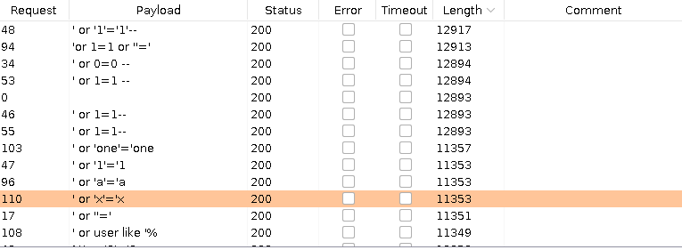

+++
author = "Alux"
title = "Portswigger Academy Learning Path: SQL Injection"
date = "2021-11-01"
description = "Lab: SQL injection vulnerability in WHERE clause allowing retrieval of hidden data"
tags = [
    "sqli",
    "portswigger",
    "academy",
    "burpsuite",
]
categories = [
    "pentest web",
]
series = ["Portswigger Labs"]
image = "head.png"
+++

# Lab: SQL injection vulnerability in WHERE clause allowing retrieval of hidden data

Este laboratorio contiene una vulnerabilidad de SQL Injection y la manera de resolverlo es que haga un ataque de SQL y que muestra los detalles de todos los productos en cualquier categoria, tanto `released` como `unreleased`.

Nos regalan una pista y se nos dice que el sistema realiza la siguiente consulta SQL

```sql
SELECT * FROM products WHERE category = 'Gifts' AND released = 1
```

## Reconocimiento

Como lo explica en la lectura del laboratorio, la aplicacion recupera datos de la categoria `Gifts` y que solo se muestre los datos que tengan `released` como valor 1.

### Payloads

He probado los siguientes payloads para saber si podria mostrar el resto de productos que no esta mostrando anteriormente.

   Payload | Accion
--------|------
    Gifts'-- | Muestra solo 1 producto mas
  Gifts'-- - | Muestra solo 1 producto master
  Gifts' and released = 0-- | Muestra solo 1 producto

## Explotacion

Al notar como hace la validacion nos podemos dar cuenta que podriamos bypassear esa instruccion, recordando a la forma en que se hace un bypass a un login. Creando la siguiente consulta a inyectar quedaria: SQL

`Gifts' or 1=1--`

Para que al final al inyectar la consulta SQL quedaria: SQL

```sql
SELECT * FROM products WHERE category = 'Gifts' or 1=1-- AND released = 1
```

Haciendo que despues de `--` se comente lo que le sigue y solo se ejecute lo primero. Adicionalmente no existe solo ese payload, se puede hacer uso de otros como la siguiente <cite>lista[^1]</cite>

[^1]: [Lista](https://raw.githubusercontent.com/swisskyrepo/PayloadsAllTheThings/master/SQL%20Injection/Intruder/Auth_Bypass2.txt) de payloads bypass login 

Y por el tamano de la salida nos podemos dar cuenta que arroja muchos datos, aunque un payload no sea aceptado se puede hacer uso de otros.

