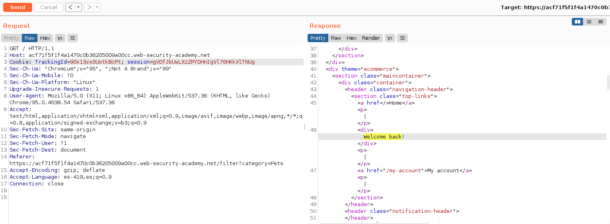
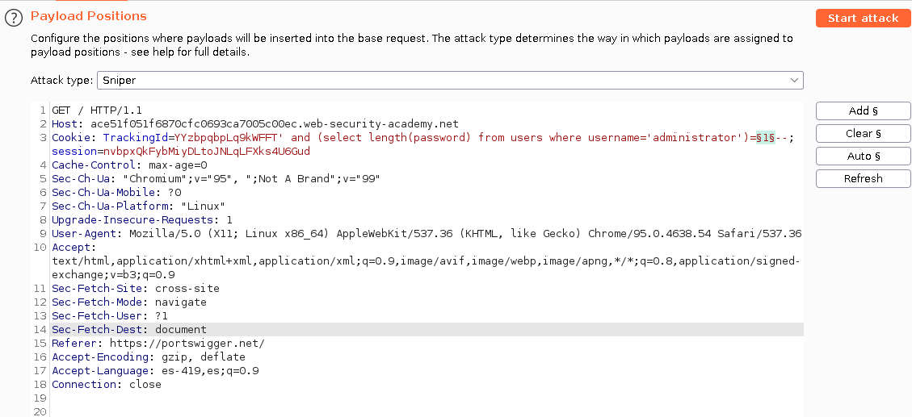
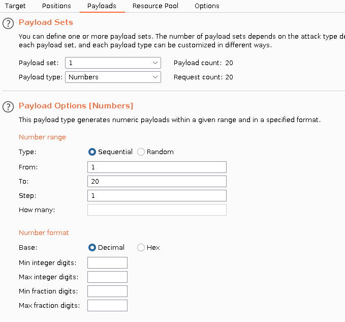
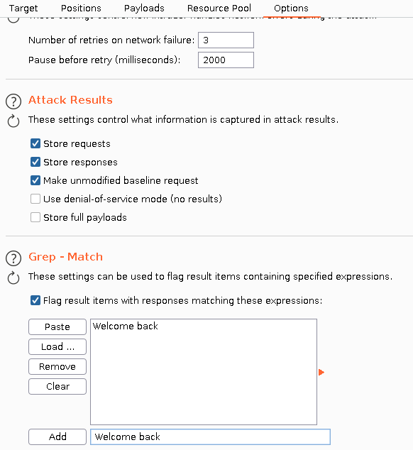
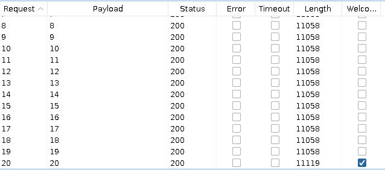
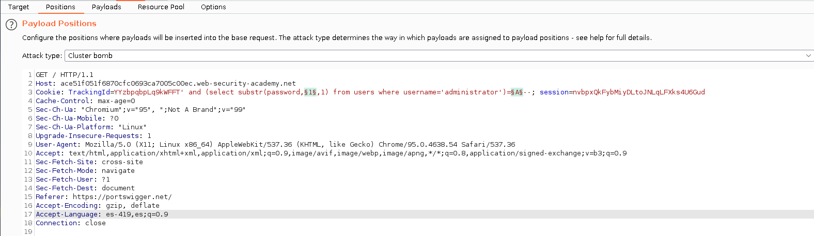
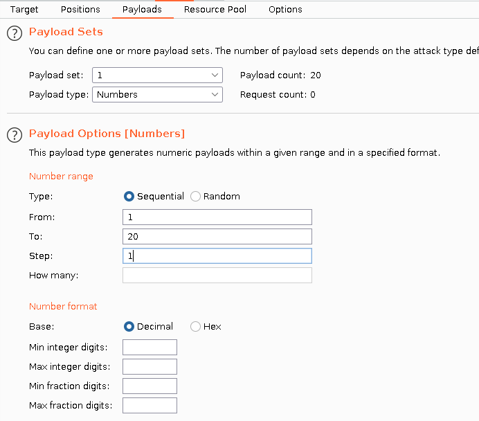
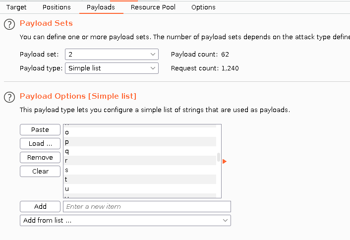
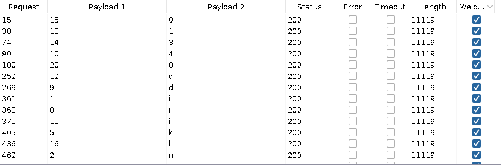
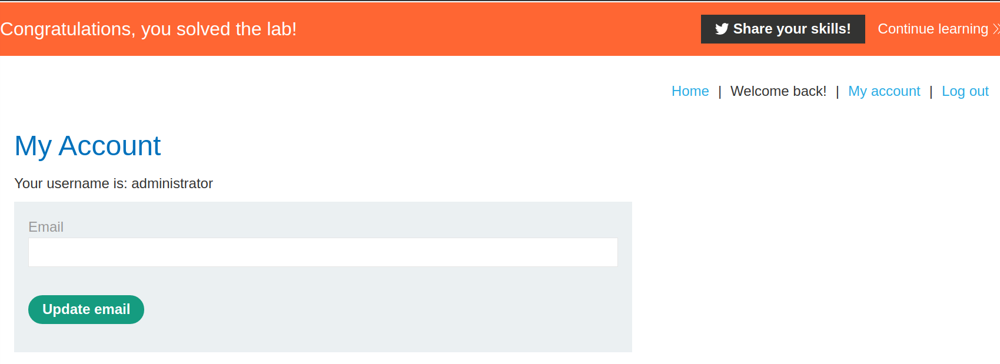

+++
author = "Alux"
title = "Portswigger Academy Learning Path: SQL Injection Lab 11"
date = "2021-11-07"
description = "Lab: Blind SQL injection with conditional responses"
tags = [
    "sqli",
    "blind",
    "portswigger",
    "academy",
    "burpsuite",
]
categories = [
    "pentest web",
]
series = ["Portswigger Labs"]
image = "head.png"
+++

# Lab: Blind SQL injection with conditional responses

En este <cite>laboratorio[^1]</cite>la finalidad es poder extraer la contrasena del usuario `administrator`, para eso se nos dan las columnas `username` y `password` de la tabla `users`.

## Reconocimiento

Lo primero es buscar donde es vulnerable a sql injection, en este caso nos dicen en el articulo que seguramente es la cookie de `TrackingId` solo queda comprobarlo.


###  Payloads

#### Detectar si es vulnerable

```
TrackingId=xxxxxxxxxxxxxxxx' and '1'='1; //Muestra welcome back
TrackingId=xxxxxxxxxxxxxxxx' and '1'='2; //No muestra welcome back
```


Al inyectar la solicitud podemos darnos cuenta que el sistema valida la cookie dependiendo de la respuesta de mysql, si hacemos una comparacion que no es correcta, el sistema ya no imprime `welcome back`.

#### Verificar tamano de la contrasena de administrator

Ahora toca construir una consulta para inyectar para poder extraer los datos de base de datos de `users`

```sql
TrackingId=xxxxxxxxxxxxxxxx' and (select length(password) from users where username='administrator')=1--
```
La siguiente solicitud lo que hace es hacer un select del tamano de la contrasena del usuario `administrator` y el valor numerico es el que ira cambiando, y hasta que el sistema devuelva la respuesta `welcome back` es porque es lo correcto, todo basandose en que la respuesta sea true si imprimira ese resultado.

En este caso construimos la siguiente captura para saber el valor del tamano de la contrasena para posteriormente ir cambiando el valor de la consulta y hacer un ataque con intruder en burpsuite para evitar hacerlo a mano y durar mucho en el proceso. Para eso crafteamos la siguiente solicitud, y agregamos como payload el valor numerico para ir cambiandolo y averiguar el tamano de la contrasena administrador.



Luego agregaremos el payload para que acepte numeros e ir probando uno por uno para posteriormente analizar el resultado. El



Y finalmente haremos un grep en la respuesta ya que si recibimos la palabra `welcome back` es porque ese es el tamano de la contrasena. Si



Y ejecutando el ataque podemos ver que la contrasena tiene un tamano de 20.



#### Tomar los datos del usuario administrator

Sabiendo ya el tamano ya podemos proceder a tomar la contrasena del usuario administrator, para eso inyectaremos la siguiente solicitud:

```sql
TrackingId=xxxxxxxxxxxxxxxx' and (select substr(password,1,1) from users where username='administrator')='A'--
```
> SUBSTR: Son 3 valores los que espera que serian
> * Variable: Puede ser nombre de tabla, string, nombre de columna
> * Segundo valor: A este se le indica desde donde quiere que se empiece a tomar en cuenta, `este es el que ira cambiando`
> * Tercero: Cuantos valores quiere que se imprima, en este caso `solo queremos 1`

Para el uso de texto enviaremos peticiones con valores del abecedario y valores numericos, para eso es mejor utilizar la siguiente <cite>lista de caracteres alfanumericos[^2]</cite>

Y ahora vamos a intruder y configuramos de la siguiente manera, de forma de cluster bomb para enviar 2 parametros y que pruebe todas las combinaciones.

> NOTA: En las capturas se muestra el valor alfanumerico sin comillas simples, por lo cual se debe de colocar



Ahora a configurar los payloads tanto del valor 1 como del 2:




Y en este caso ya hemos obtenido los resultados, solamente queda unirlos para entrar como el usuario `administrator` que quedaria con el password `inpxkyrid4icz30lq1v8`:



Y con esto hemos resulto el lab:



Con esto ya muestra que se ha resuelto el lab.

[^1]: [Laboratorio](https://portswigger.net/web-security/sql-injection/blind/lab-conditional-responses)
[^2]: [Caracteres alfanumericos](https://raw.githubusercontent.com/danielmiessler/SecLists/master/Fuzzing/alphanum-case.txt)