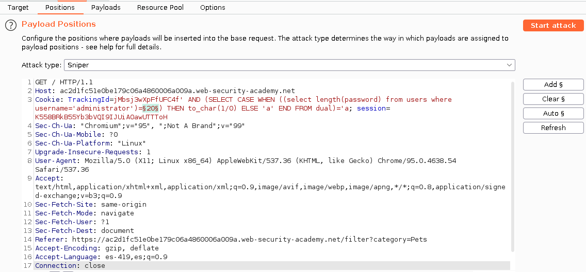
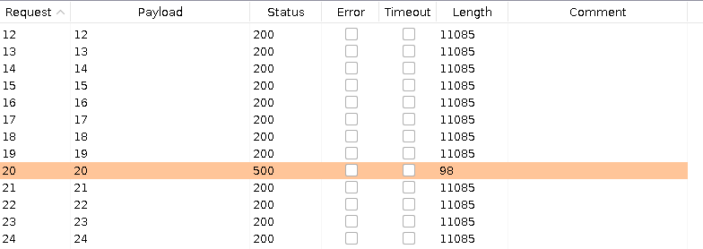
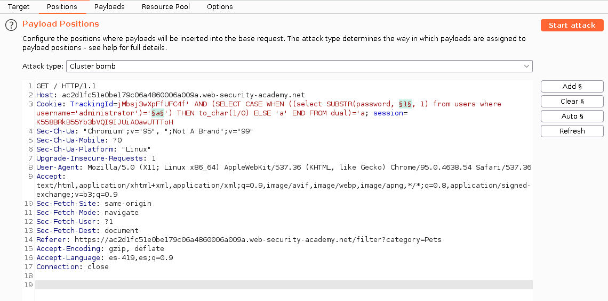
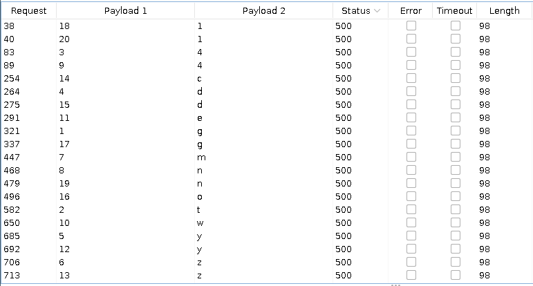
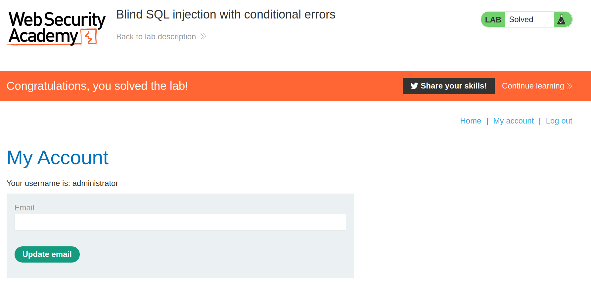

+++
author = "Alux"
title = "Portswigger Academy Learning Path: SQL Injection Lab 8"
date = "2021-11-06"
description = "# Lab: Blind SQL injection with conditional errors"
tags = [
    "sqli",
    "portswigger",
    "academy",
    "burpsuite",
]
categories = [
    "pentest web",
]
series = ["Portswigger Labs"]
image = "head.png"
+++

# # Lab: Blind SQL injection with conditional errors

En este <cite>laboratorio[^1]</cite>la finalidad es poder extraer la contrasena de la tabla `users` del usuario `administrator`. Ademas se indica que esta utilizando en el backend Oracle por lo cual procederemos a buscar la informacion sobre este.  


## Reconocimiento

Al abrir la aplicacion vemos que ya no se comporta como en el Lab11 lo que nos permitia que segun la respuesta devuelta por el servidor saber si la consulta que realizabamos era true o false.

Ahora lo que se puede hacer es inyectar una consulta SQL que nos genere ese error a proposito para saber si la consulta es true o false y el error terminara dando un error en el servidor y nos guiaremos por eso. Y ya que sabemos que es un backend Oracle haremos la siguiente prueba a inyectar en la cookie

En este caso inyectaremos la siguiente peticion:

```sql
xxxxx' AND (SELECT CASE WHEN (1=2) THEN to_char(1/0) ELSE 'a' END FROM dual)='a	//muestra la pagina normal
xxxxx' AND (SELECT CASE WHEN (1=1) THEN to_char(1/0) ELSE 'a' END FROM dual)='a //muestra un error de servidor
```

Lo que hace practicamente es que se cumpla la condicion de la cookie y luego la dentro del select genera un propio error que nos dira si es true o false segun la condicion que queramos, en este caso de prueba se valida con `1=1` o `1=2` aqui genera error del servidor solo si se cumple como pasa con la condicion `1=1`, practicamente es un codigo que en cualquier lenguaje de programacion se ve, por ultimo si la condicion no es correcta como la salida sera `'a'` solo valida que sea igual a la ultima a ingresada `'a` con una sola comilla al inicio para que la ultima la agregue el propio sistema a la que le colocaria a la cookie.

###  Payloads

#### Recuperar tamano de contrasena

Como en el laboratorio anterior tocara saber el tamano de la contrasena y para eso utilizaremos la siguiente consulta inyectada:

```sql
xxxxx' AND (SELECT CASE WHEN ((select length(password) from users where username='administrator')=§20§) THEN to_char(1/0) ELSE 'a' END FROM dual)='a
```

Esta inyeccion hace validar el tamano de la contrasena, si la contrasena tiene el tamano que se le indica hara que la aplicacion genere un error `500` en el servidor de `Internal Server Error`.



Al valor se le hara una peticion de 1 hasta 30 para saber cual es el tamano de la contrasena y como se muestra la aplicacion genera un error `500` con el payload 20 lo que significa que la contrasena tiene 20 caracteres.



### Recuperar la contrasena

Ahora que sabemos el tamano ya podemos enviar la peticion para recuperarla, ahora para recuperar la contrasena utilizaremos la siguiente consulta para inyectar:

```sql
xxxxx' AND (SELECT CASE WHEN ((select SUBSTR(password, 1, 1) from users where username='administrator')='a') THEN to_char(1/0) ELSE 'a' END FROM dual)='a
```

Ahora vamos a realizar un ataque de clusterbomb enviando en el primer parametro el valor que cambiara de 1 a 20 y en el segundo un caracter alfanumerico.



Y al terminar el ataque podemos notar que los que dan un error 500 del lado servidor son donde la condicion fue true y toca tomar toda esa informacion para formar la contrasena:



Al finalizar y formar la contrasena seria `gt4dyzmn4weyzcdog1n1` y podemos iniciar sesion en la aplicacion para completar el laboratorio

Y con esto hemos resulto el lab:



Con esto ya muestra que se ha resuelto el lab.

[^1]: [Laboratorio](https://portswigger.net/web-security/sql-injection/blind/lab-conditional-errors)