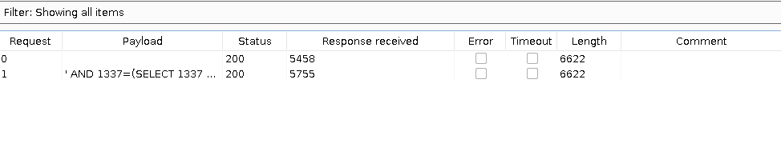
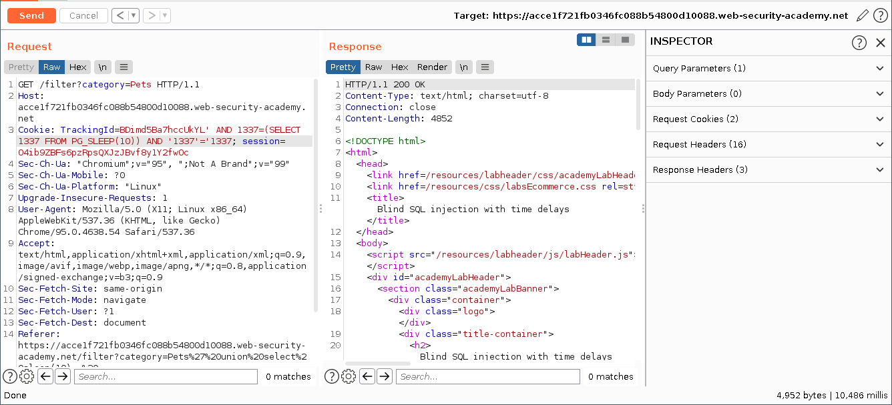
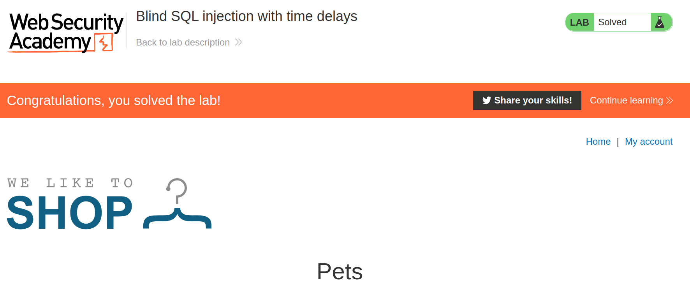

+++
author = "Alux"
title = "Portswigger Academy Learning Path: SQL Injection Lab 13"
date = "2021-11-08"
description = "Lab: Blind SQL injection with time delays"
tags = [
    "sqli",
    "portswigger",
    "academy",
    "burpsuite",
]
categories = [
    "pentest web",
]
series = ["Portswigger Labs"]
image = "head.png"
+++

# Lab: Blind SQL injection with time delays

En este <cite>laboratorio[^1]</cite>la finalidad es poder explotar una vulnerabilidad de sql injection pero basandose en tiempo, en este caso la inyeccion solo es para poder inyectar un codigo que genere un delay hacia el backend de la base de datos, lo cual la respuesta tardara segun el tiempo que nosotros le inyectemos. En base a ese tiempo despues podriamos generar una consulta if para poder devolvernos si la consulta hecha es true o false.

## Reconocimiento
Se pide que solo se inyecte una consulta sql que cause un delay de 10 segundos asi que buscaremos la vulnerabilidad en la aplicacion y para generar un delay con cada backend seria un ejemplo:

Oracle

`dbms_pipe.receive_message(('a'),10)`

Microsoft

`WAITFOR DELAY '0:0:10'`

PostgreSQL

`SELECT pg_sleep(10)`

MySQL

`SELECT sleep(10)`

###  Payloads

En este caso he conocido otra <cite>lista[^2]</cite> donde reune todos los payloads que se pueden inyectar para generar una vulnerabilidad sql. Al hacer tantas combinaciones, se pudo generar una o varias la cual permiten que se genere un delay en la aplicacion. Todo esto podemos verlo gracias a uno de los probados son:

```sql
xxxxxxxxx' AND 1337=(SELECT 1337 FROM PG_SLEEP(5)) AND '1337'='1337
```

Lo primero a agregar es que se debe de activar la columna `response received` para ver el tiempo que la respuesta a tardado en ser recibida, lo que nos indica que se inyecto una consult sql.




Ahora la enviaremos por repeater con un sleep de 10 segundos y ver si tarda 10 segundos en responder y si vemos de lado derecho la peticion dura 10,486 millis en responder.



Y con esto hemos resulto el lab:



Con esto ya muestra que se ha resuelto el lab.

[^1]: [Laboratorio](https://portswigger.net/web-security/sql-injection/blind/lab-time-delays)
[^2]: [Lista de Payloads SQL Injection Time Based](https://ansar0047.medium.com/blind-sql-injection-detection-and-exploitation-cheatsheet-17995a98fed1)