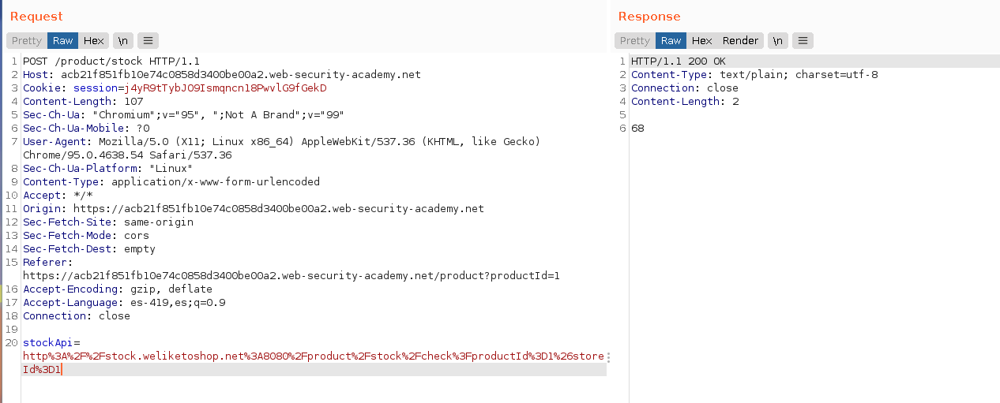
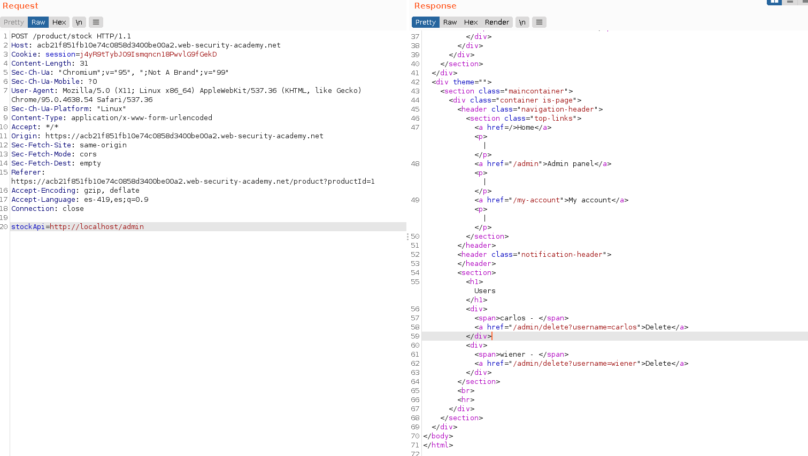
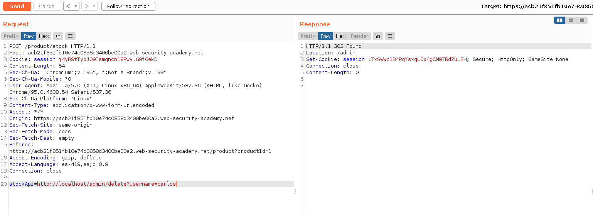
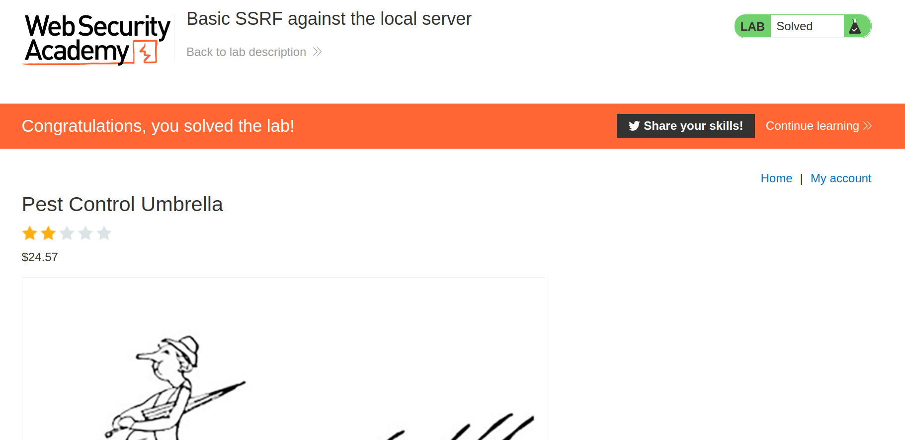

+++
author = "Alux"
title = "Portswigger Academy Learning Path: Server-side request forgery (SSRF) Lab 1"
date = "2022-01-14"
description = "Lab: Basic SSRF against the local server"
tags = [
    "ssrf",
    "server-side request forgery",
    "portswigger",
    "academy",
    "burpsuite",
]
categories = [
    "pentest web",
]
series = ["Portswigger Labs"]
image = "head.png"
+++

# Lab: Basic SSRF against the local server

En este <cite>laboratorio[^1]</cite>la finalidad es poder realizar ataques de ssrf que esta vulnerabildad trata de realizar solicitudes hacia otros dominios o ip arbitrarias a la cual el host puede tener acceso como puede ser una red interna a la que no se podria tener acceso desde afuera.


## Reconocimiento

Viendo la web podemos notar una solicitud en concreto que se hace para checar el stock del producto.



Decodificada la URL seria la siguiente, lo que nos indica que se hace una solicitud `GET` hacia `stock.weliketoshop.net` en el puerto `8080`

```
http://stock.weliketoshop.net:8080/product/stock/check?productId=1&storeId=1
```

## Explotacion

Ahora que sabemos todo esto lo que debemos hacer es eliminar al usuario `carlos` en el `localhost`. Para eso realizamos la siguiente solicitud para ver si podemos cambiar la url por http://localhost/admin y ver si nos muestra la informacion sin errores.

> Si entramos a /admin en el servicio nos salta la alerta de: `Admin interface only available if logged in as an administrator, or if requested from loopback`



Ya notamos que podemos enviar solicitudes al servicio web que tenemos en el puerto 80 porque desde localhost la interfaz administrativa no esta protegida. Asi que ahora podremos eliminar al usuario carlos.



Y ahora ya hemos resuelto el lab eliminando al usuario.




[^1]: [Laboratorio](https://portswigger.net/web-security/ssrf/lab-basic-ssrf-against-localhost)