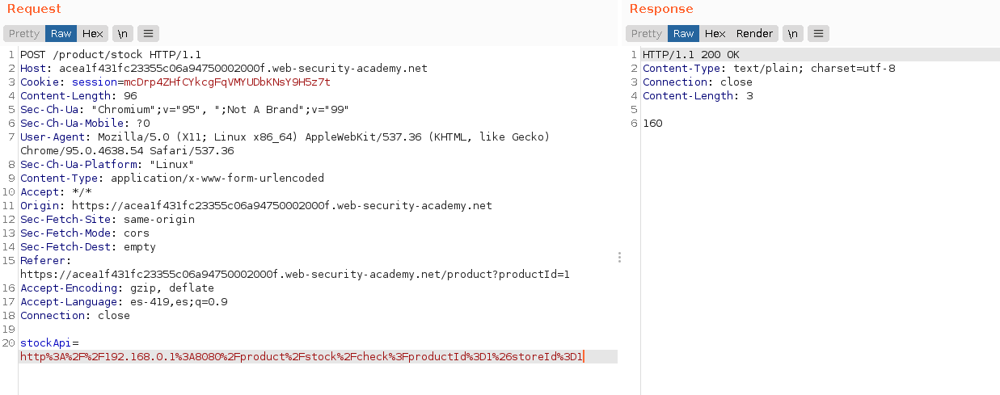
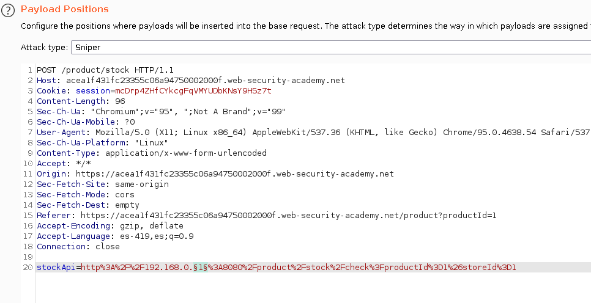
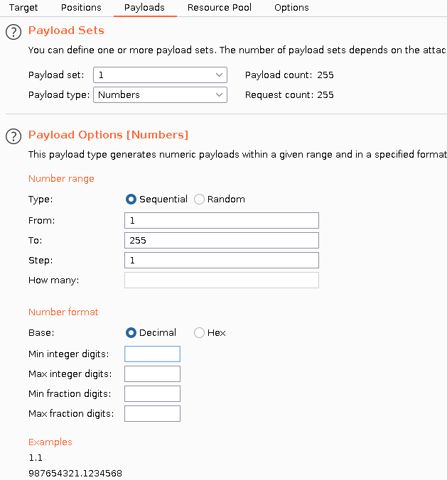
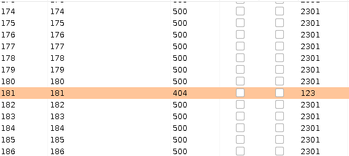
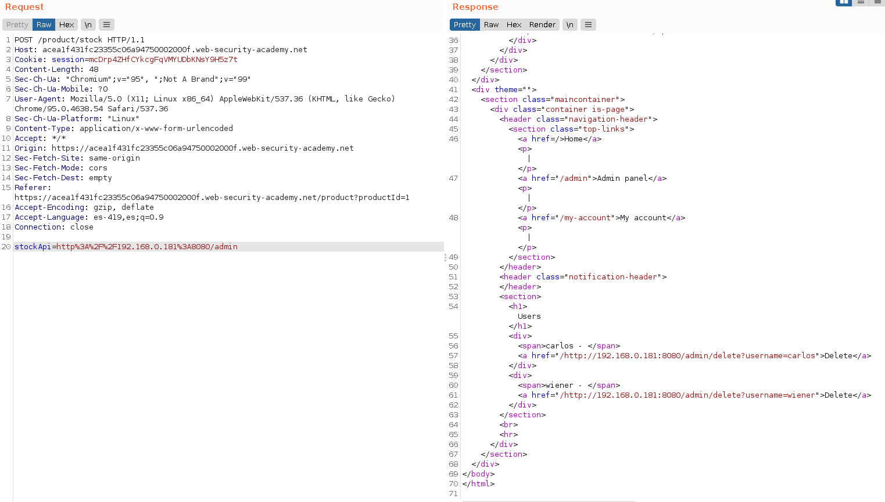
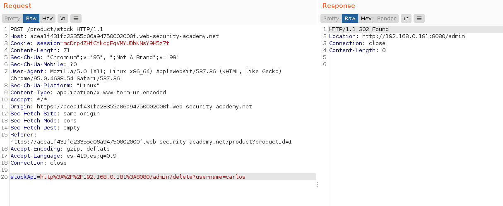
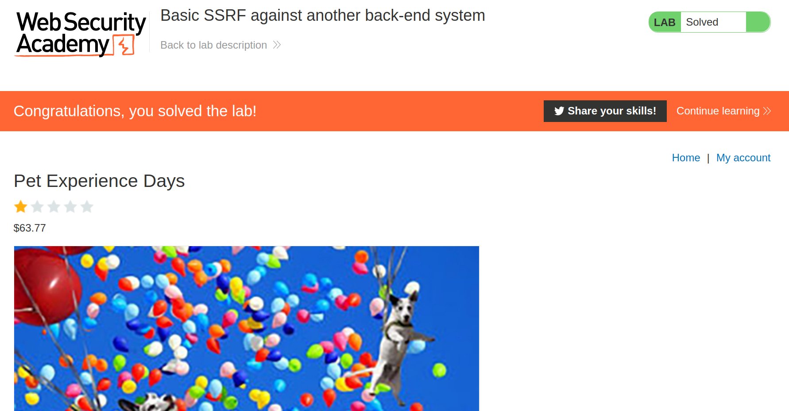

+++
author = "Alux"
title = "Portswigger Academy Learning Path: Server-side request forgery (SSRF) Lab 2"
date = "2022-01-14"
description = "Lab: Basic SSRF against another back-end system"
tags = [
    "ssrf",
    "server-side request forgery",
    "portswigger",
    "academy",
    "burpsuite",
]
categories = [
    "pentest web",
]
series = ["Portswigger Labs"]
image = "head.png"
+++

# Lab: Basic SSRF against another back-end system

En este <cite>laboratorio[^1]</cite>la finalidad es poder realizar ataques de ssrf que esta vulnerabildad trata de realizar solicitudes hacia otros dominios o ip arbitrarias a la cual el host puede tener acceso como puede ser una red interna a la que no se podria tener acceso desde afuera.


## Reconocimiento

Viendo la web podemos notar una solicitud en concreto que se hace para checar el stock del producto.



Decodificada la URL seria la siguiente, lo que nos indica que se hace una solicitud `GET` hacia `stock.weliketoshop.net` en el puerto `8080`

```
http://192.168.0.1:8080/product/stock/check?productId=1&storeId=1
```

## Explotacion

Ahora que sabemos todo esto lo que debemos hacer es eliminar al usuario `carlos` en el `localhost`. Pero debemos encontrar el acceso hacia otra ip en local en la red 192.168.0/24, para eso debemos encontrar primero la ip a la que acceder o la que podriamos tener acceso y luego eliminar a carlos.

Preparamos nuestro payload para enviar la solicitud en este caso cambiaremos el valor de la ip para que recorrar desde la 1 hasta 255.



Y configuramos el payload para configurar los valores del 1 al 255



Y empezamos el ataque con lo que tenemos una respuesta con uno, especificamente es el unico que cambia junto con la ip `192.168.0.1`, obteniendo un `404` por lo que sabemos que esa ip si esta arriba



Ahora sabiendo la ip a la que podemos acceder ya podemos enviar la peticion para poder eliminar al usuario carlos, pero antes comprobar que si tenemos al sistema administrativo.



Ahora enviamos la peticion `GET` para eliminar al usuario carlos definitivamente



Y ahora ya hemos resuelto el lab eliminando al usuario.




[^1]: [Laboratorio](https://portswigger.net/web-security/ssrf/lab-basic-ssrf-against-backend-system)