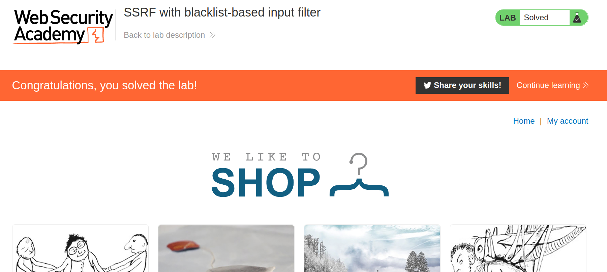

+++
author = "Alux"
title = "Portswigger Academy Learning Path: Server-side request forgery (SSRF) Lab 3"
date = "2022-01-16"
description = "Lab: SSRF with blacklist-based input filter"
tags = [
    "ssrf",
    "server-side request forgery",
    "portswigger",
    "academy",
    "burpsuite",
]
categories = [
    "pentest web",
]
series = ["Portswigger Labs"]
image = "head.png"
+++

# Lab: SSRF with blacklist-based input filter

En este <cite>laboratorio[^1]</cite>la finalidad es poder realizar ataques de ssrf que esta vulnerabildad trata de realizar solicitudes hacia otros dominios o ip arbitrarias a la cual el host puede tener acceso como puede ser una red interna a la que no se podria tener acceso desde afuera.


## Reconocimiento

Viendo la web podemos notar una solicitud en concreto que se hace para checar el stock del producto.


Decodificada la URL seria la siguiente, lo que nos indica que se hace una solicitud `GET` hacia `stock.weliketoshop.net` en el puerto `8080`

```
http://stock.weliketoshop.net:8080/product/stock/check?productId=1&storeId=1
```

## Explotacion

Primero debemos averiguar con que host si se nos acepta la peticion para despues pedir la interfaz administrativa. Para eso tomaremos alternativas a `localhost` ya que todas resuelven a el pero escritas de manera distinta.

```
127.127.127.127
1227.0.1.3
127.0.0.0
127.1
127.0.1
```

En nuestro caso tenemos dos ips que nos resuelven y nos muestran que si se podria ingresar a la interfaz de `admin`, estos son `127.0.1` y `127.1`


Ahora que sabemos todo esto lo que debemos hacer es eliminar al usuario `carlos` en el `localhost`. Pero ahora existe algo que nos bloqueara al querer intentar realizar una peticion al localhost

Ahora lo que intentaremos es hacer una peticion para solicitar al localhost, pero nos da la siguiente alerta, pero es al intentar ir al path de `/admin/` el sistema cuenta con este bloqueo que no nos dejara ir mas alla.


Sabiendo esto lo que haremos sera codificar muchas veces `admin` en URL con el mismo burp esto se hace con `Ctrl + U` y haciendo la peticion obtenemos que el usuario carlos ha sido eliminado sin saltar la alerta como antes.


Y ahora ya hemos resuelto el lab eliminando al usuario.




[^1]: [Laboratorio](https://portswigger.net/web-security/ssrf/lab-ssrf-with-blacklist-filter)