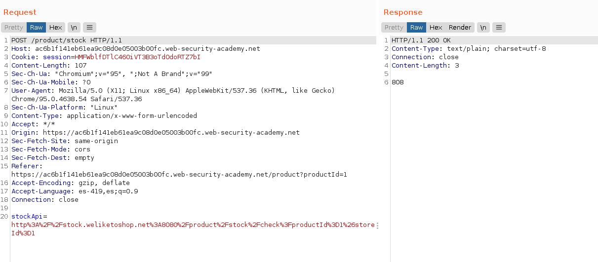
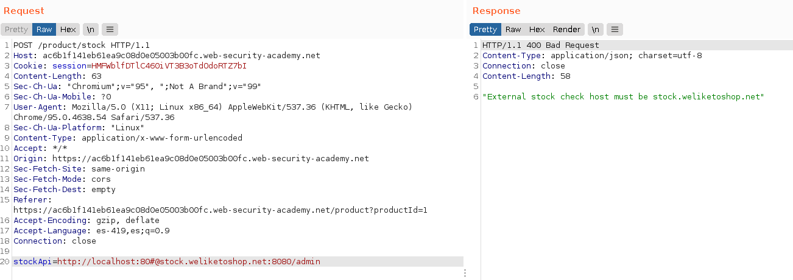
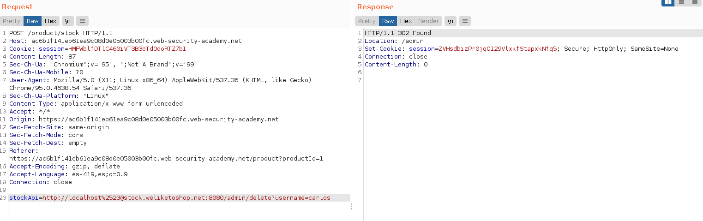
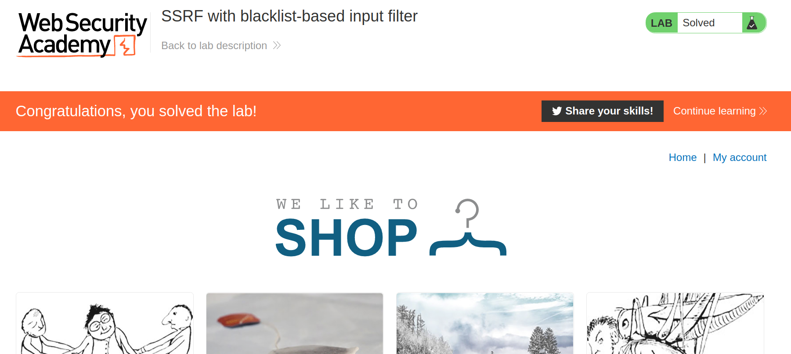

+++
author = "Alux"
title = "Portswigger Academy Learning Path: Server-side request forgery (SSRF) Lab 4"
date = "2022-01-17"
description = "Lab: SSRF with whitelist-based input filter"
tags = [
    "ssrf",
    "server-side request forgery",
    "portswigger",
    "academy",
    "burpsuite",
]
categories = [
    "pentest web",
]
series = ["Portswigger Labs"]
image = "head.png"
+++

# Lab: SSRF with whitelist-based input filter

En este <cite>laboratorio[^1]</cite>la finalidad es poder realizar ataques de ssrf que esta vulnerabildad trata de realizar solicitudes hacia otros dominios o ip arbitrarias a la cual el host puede tener acceso como puede ser una red interna a la que no se podria tener acceso desde afuera.


## Reconocimiento

Viendo la web podemos notar una solicitud en concreto que se hace para checar el stock del producto.



Decodificada la URL seria la siguiente, lo que nos indica que se hace una solicitud `GET` hacia `stock.weliketoshop.net` en el puerto `8080`

```
http://stock.weliketoshop.net:8080/product/stock/check?productId=1&storeId=1
```

## Explotacion

Lo primero es ver si el sistema cuenta con filtrado el cual no permita ingresar otro dominio y si es con lo primero que nos topamos, el cual no nos dejara ingresar mas que el dominio de `stock.weliketoshop.net`.



Leyendo un poco encontre algo sobre realizar el bypass para dominios, en este caso porque el dominio esta en una whitelist y no podriamos ingresar mas que este.

https://www.blackhat.com/docs/us-17/thursday/us-17-Tsai-A-New-Era-Of-SSRF-Exploiting-URL-Parser-In-Trending-Programming-Languages.pdf

Un payload en especifico es el siguiente, el cual es una investigacion en la cual existe la manera de hacer un bypass porque el parsing tomara el dominio que no debe y como valido.

```
domain.com#@whitelistdomain.com
```
Pero al intentarlo seguia alertando de que no se podia por lo que es necesario codificar doblemente como en uno de los ejercicios anteriores para que el sistema lo tome correctamente y realizar el bypass para quedar asi.

```
http://localhost%2523@stock.weliketoshop.net:8080/admin
```

Luego realizamos la peticion y se logra bypassear el whitelist del dominio.



Y ahora ya hemos resuelto el lab eliminando al usuario.




[^1]: [Laboratorio](https://portswigger.net/web-security/ssrf/lab-ssrf-with-whitelist-filter)