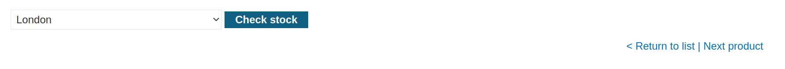
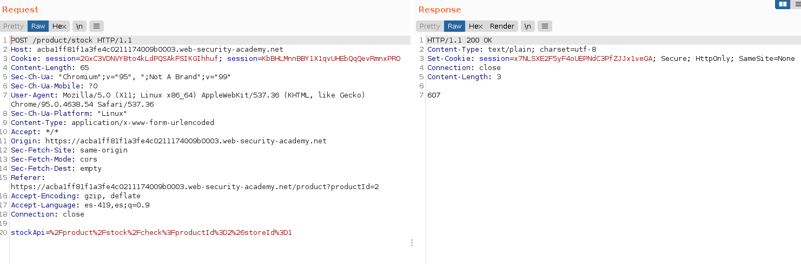
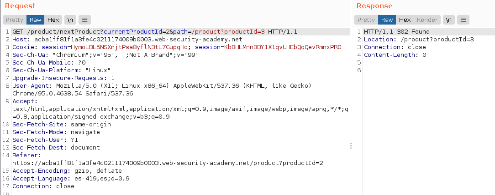
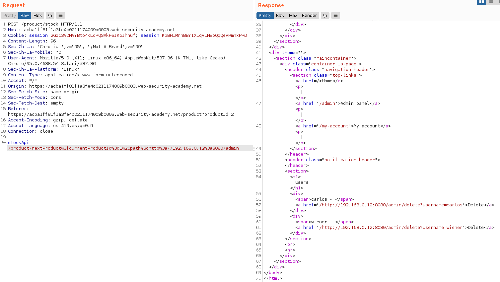
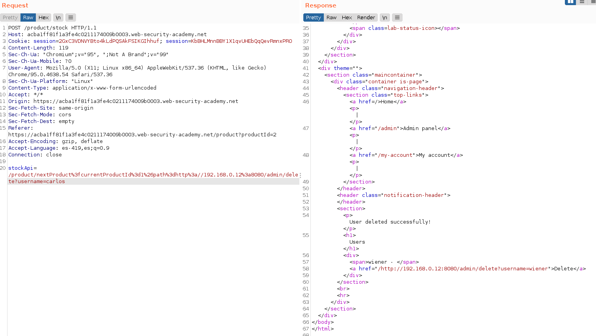
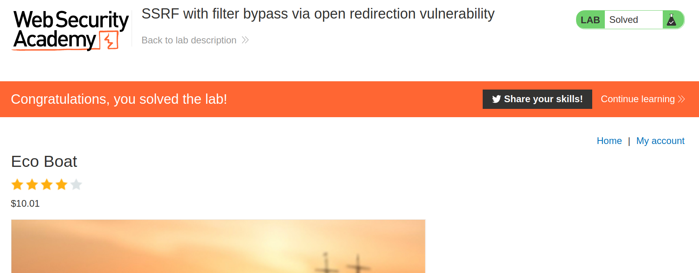

+++
author = "Alux"
title = "Portswigger Academy Learning Path: Server-side request forgery (SSRF) Lab 5"
date = "2022-01-20"
description = "Lab: SSRF with filter bypass via open redirection vulnerability"
tags = [
    "ssrf",
    "server-side request forgery",
    "portswigger",
    "academy",
    "burpsuite",
]
categories = [
    "pentest web",
]
series = ["Portswigger Labs"]
image = "head.png"
+++

# Lab: SSRF with filter bypass via open redirection vulnerability

En este <cite>laboratorio[^1]</cite>la finalidad es poder realizar ataques de ssrf que esta vulnerabildad trata de realizar solicitudes hacia otros dominios o ip arbitrarias a la cual el host puede tener acceso como puede ser una red interna a la que no se podria tener acceso desde afuera.


## Reconocimiento

Viendo la web podemos notar una solicitud en concreto que se hace para checar el stock del producto.






Decodificada la URL seria la siguiente, lo que nos indica que se hace una solicitud `GET` hacia `stock.weliketoshop.net` en el puerto `8080`

```
stockApi=%2Fproduct%2Fstock%2Fcheck%3FproductId%3D2%26storeId%3D1
stockApi=/product/stock/check?productId=2&storeId=1
```

Pero aparte notamos otra solicitud a la hora de solicitar un siguiente producto con la siguiente peticion, que notaremos que podriamos utilizar para realizar SSRF el cual es el parametro de `path` que se le pasa la ruta en la cual podriamos inyectar un host y ver si lo devuelve sin problema. Por lo que si cambiamos el path a un dominio nos redirige pero en nuestra propia pc y deberiamos de intentar inyectarlo en `stockApi`.

```
stockApi=/product/nextProduct?currentProductId=2&path=/product?productId=3
```



## Explotacion

Ahora que sabemos como proceder intentaremos es inyectar un host para que el sistema nos redirija hacia el objetivo que es `http://192.168.0.12:8080/admin` y llegar a el. Asi que procedemos a inyectar la solicitud normal pero cambiaremos el valor de `stockApi` por el archivo que nos redirigira a la siguiente pagina y modificando el path por `http://192.168.0.12:8080/admin` y debieramos de tener acceso.

```
stockApi=/product/nextProduct?currentProductId=2&path=http://host/admin
```



Viendo que lo acepta sin problema ahora procedemos a realizar la solicitud de la eliminacion solo agregando la peticion para la eliminacion.



Y ahora ya hemos resuelto el lab eliminando al usuario.




[^1]: [Laboratorio](https://portswigger.net/web-security/ssrf/lab-ssrf-filter-bypass-via-open-redirection)