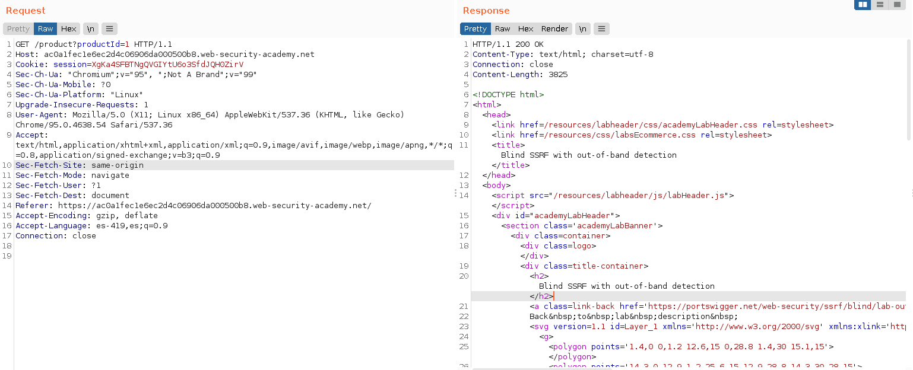
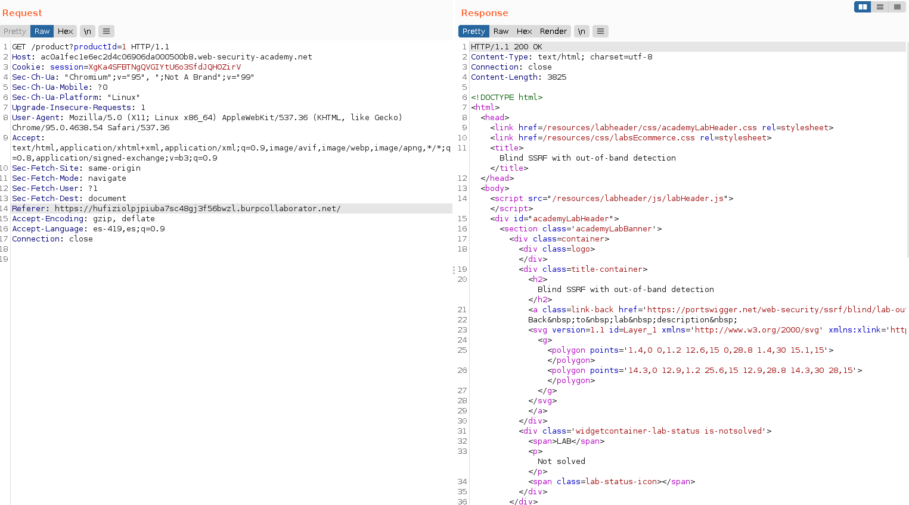
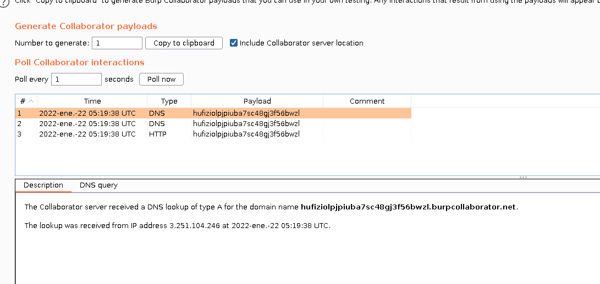
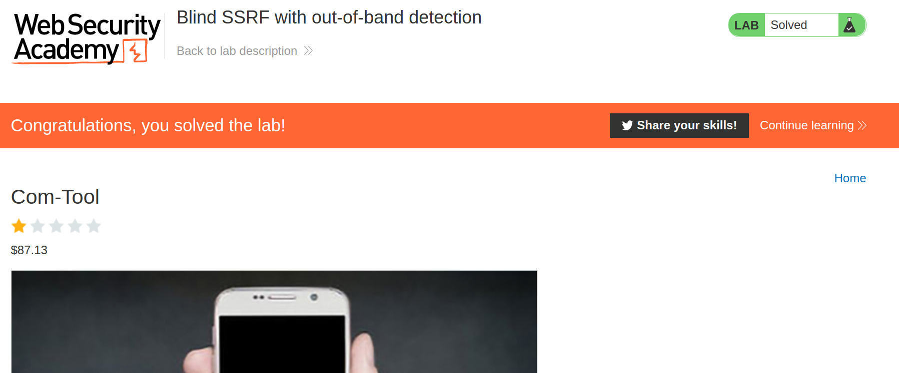

+++
author = "Alux"
title = "Portswigger Academy Learning Path: Server-side request forgery (SSRF) Lab 6"
date = "2022-01-21"
description = "Lab: Blind SSRF with out-of-band detection"
tags = [
    "ssrf",
    "server-side request forgery",
    "shellshock",
    "portswigger",
    "academy",
    "burpsuite",
]
categories = [
    "pentest web",
]
series = ["Portswigger Labs"]
image = "head.png"
+++

# Lab: Blind SSRF with out-of-band detection

En este <cite>laboratorio[^1]</cite>la finalidad es poder realizar ataques de ssrf que esta vulnerabildad trata de realizar solicitudes hacia otros dominios o ip arbitrarias a la cual el host puede tener acceso como puede ser una red interna a la que no se podria tener acceso desde afuera pero esta vez no es tan interna.

## Reconocimiento

Viendo la web y la informacion que nos da el lab es que el sistema envia la url al terminar de cargar toda la pagina y esto a traves del `Referer Header`.

## Explotacion

Sabiendo esto lo unico que debemos hacer es enviar la solicitud para cambiar la url del referer e ingresar uno generado por burpcollaborator.

Y hemos recibido una peticion en Burp Collaborator y

Y ahora ya hemos resuelto el lab automaticamente.

[^1]: [Laboratorio](https://portswigger.net/web-security/ssrf/blind/lab-out-of-band-detection )