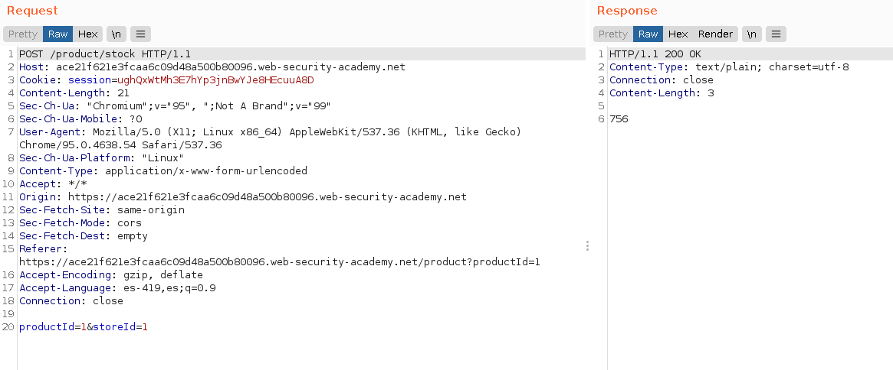

+++
author = "Alux"
title = "Portswigger Academy Learning Path: XML external entity (XXE) Lab 8"
date = "2022-01-26"
description = "Lab: Exploiting XInclude to retrieve files"
tags = [
    "xxe",
    "portswigger",
    "academy",
    "burpsuite",
]
categories = [
    "pentest web",
]
series = ["Portswigger Labs"]
image = "head.png"
+++

# Lab: Exploiting XInclude to retrieve files

La vulnerabilidad o el ataque de XXE es poder realizar una inyeccion XML en la aplicacion que analiza la entrada que le pasa el usuario o el sistema. Lo que hace que un analizados XML no este configuracion o este configurado debilmente para que procese peticiones que un usuario mal intencionado pueda inyectar. Pudiendo llegar a ejecucion de comandos, lectura de archivos y otros.


## Reconocimiento

En este <cite>laboratorio[^1]</cite>la finalidad es poder realizar una inyeccion XXE valiendose de la configuracion debil del analizador. Pero esta vez exfiltrando datos a travez de un DTD interno el cual vamos a utilizar para generar un error y exfiltrar los datos del archivo `/etc/passwd/`

Primero notamos la opcion de `Check stock` de la web en la que recuperamos la existencia de los productos.


Al ir a la opcion de `Check stock` en burp vemos la peticion que se hace al servidor usando lenguaje XML para realizar la peticion.

```xml
productId=1&storeId=1
```



## Explotacion

Ahora como vemos la peticion no tiene una estructura especificamente como xml aunque si se envia asi pero puede que se envie y el propio backend efectua en analizador xml y lo junta con el resto. Para eso inyectaremos un ataque de XInclude, que lo que hace es permitir crear documentos XML porque nosotros no controlamos el XML ahora. La forma de hacer una inyeccion es de la siguiente manera y haciendo referencia al archivo que queremos leer.

```xml
<foo xmlns:xi="http://www.w3.org/2001/XInclude">
<xi:include parse="text" href="file:///etc/passwd"/></foo>
```


Y con esto hemos resuelto el lab. 


[^1]: [Laboratorio](https://portswigger.net/web-security/xxe/lab-xinclude-attack)